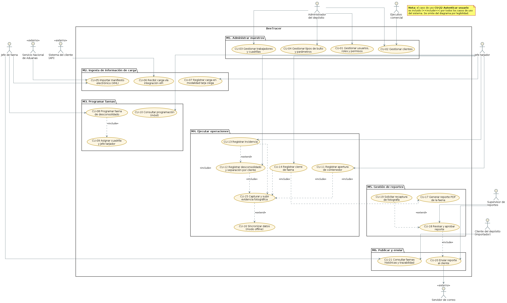
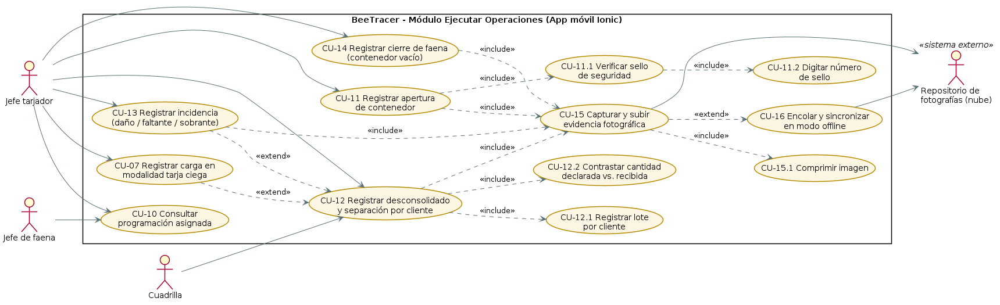
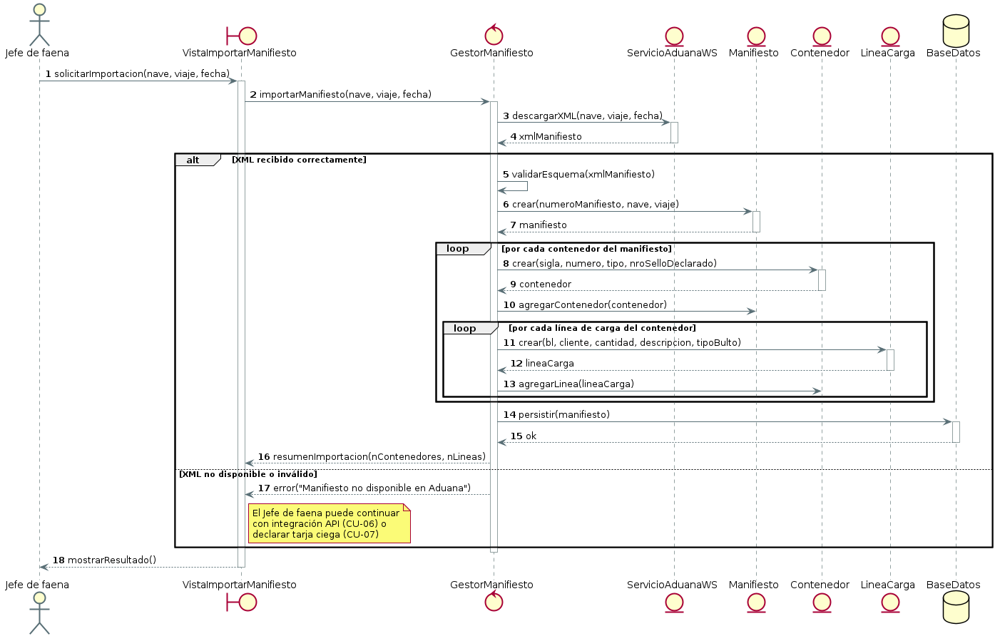
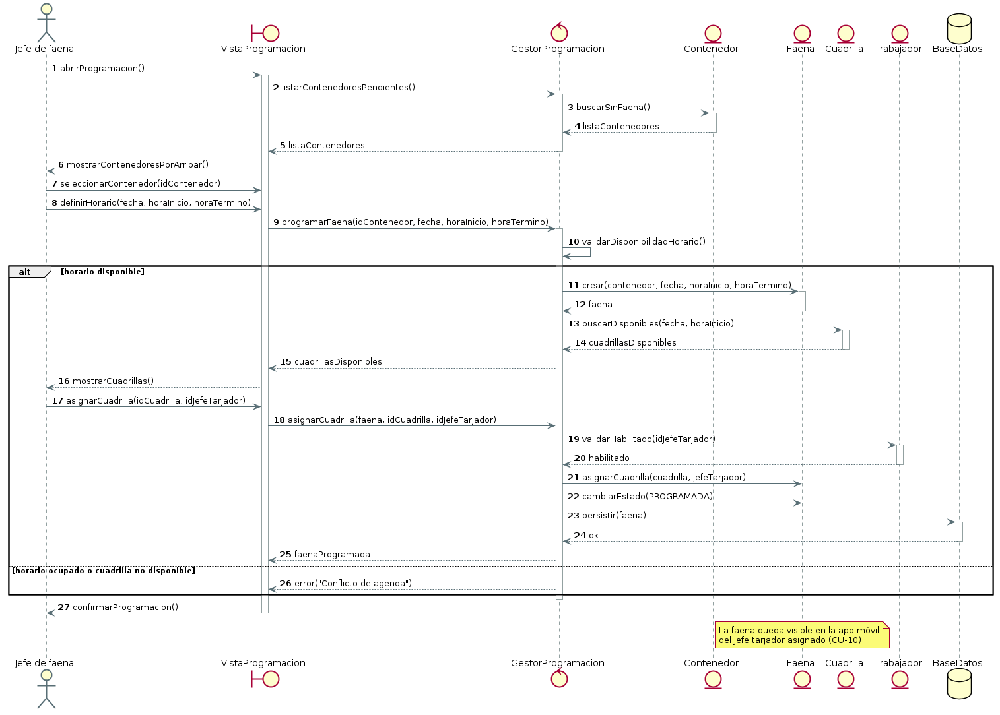
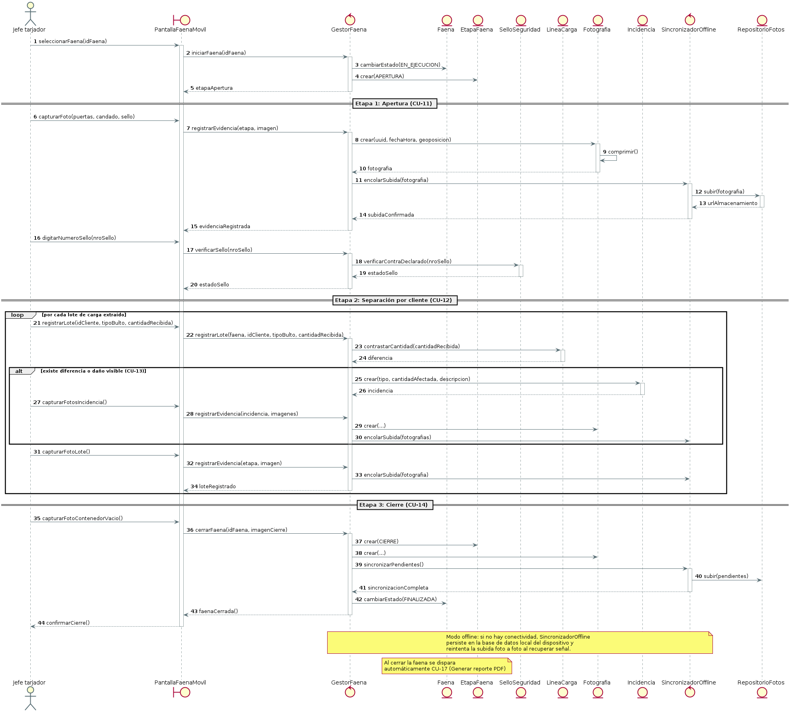
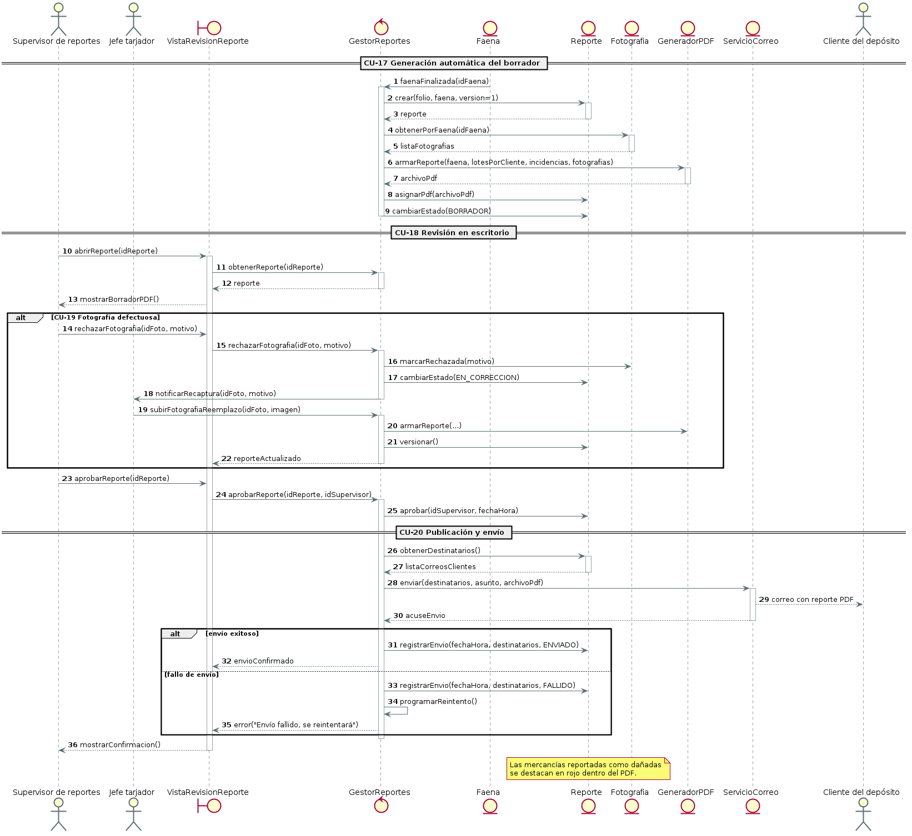
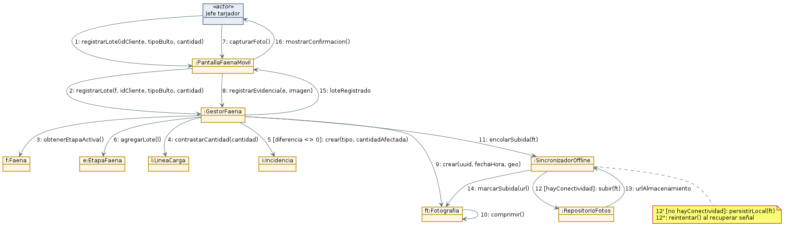
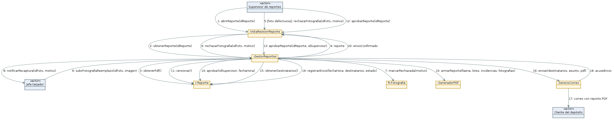
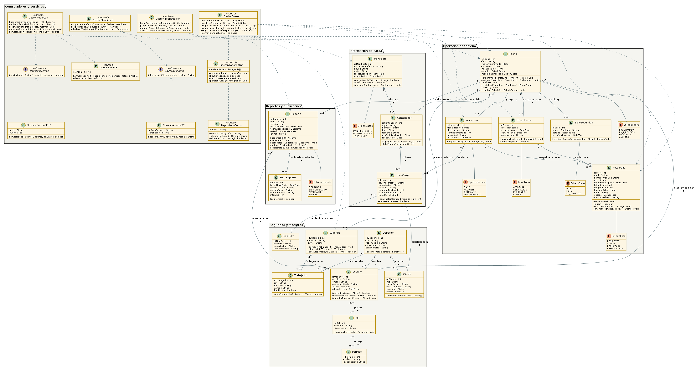

# Informe 2 — Modelamiento UML

## Caso de estudio: **BeeTracer** (Bilix Ingeniería)
### Trazabilidad y evidencia fotográfica del desconsolidado en terminales extraportuarios

---

**Asignatura:** ICI-3242 — Modelamiento de Software
**Carrera:** Ingeniería Civil en Informática / Ingeniería de Ejecución en Informática
**Institución:** Pontificia Universidad Católica de Valparaíso — Escuela de Ingeniería Informática

> 🔲 **[POR COMPLETAR — datos de portada]**
>
> | Campo | Valor |
> |---|---|
> | Integrante(s) | *Renato Espina E.* — completar con el resto del equipo |
> | Rol(es) / N.º de alumno | |
> | Profesor(a) | |
> | Sección / Paralelo | |
> | Fecha de entrega | |

---

## Índice

1. [Introducción](#1-introducción)
2. [Definición del problema](#2-definición-del-problema)
3. [Descripción general](#3-descripción-general)
4. [Clientes y usuarios](#4-clientes-y-usuarios)
5. [Funciones del sistema (alto nivel)](#5-funciones-del-sistema-alto-nivel)
6. [Diagrama de Casos de Uso](#6-diagrama-de-casos-de-uso)
7. [Diagramas de Secuencia y Colaboración](#7-diagramas-de-secuencia-y-colaboración)
8. [Diagrama de Clases (de Diseño)](#8-diagrama-de-clases-de-diseño)
9. [Diccionario de Clases](#9-diccionario-de-clases)
10. [Conclusiones](#10-conclusiones)
11. [Referencias bibliográficas](#11-referencias-bibliográficas)

---

## 1. Introducción

El presente informe corresponde a la segunda entrega del proyecto semestral de la asignatura
**ICI-3242 Modelamiento de Software**, y tiene por objetivo **modelar mediante UML** el sistema
**BeeTracer**, una plataforma real de trazabilidad logística desarrollada por la empresa
**Bilix Ingeniería** (Valparaíso, Chile) y actualmente operativa en terminales extraportuarios
de la V Región.

A diferencia de un proyecto de desarrollo convencional, este trabajo se aborda mediante
**ingeniería inversa**: no se dispone del código fuente del sistema ni de su documentación
técnica interna. El modelo aquí presentado se construyó a partir de tres fuentes de información:

1. **La charla técnica dictada por el equipo de BeeTracer**, en la que se explicó en detalle el
   proceso logístico de importación, el flujo operativo del software y las decisiones de
   arquitectura que lo condicionaron.
2. **La información pública de la plataforma** (sitio web comercial de BeeTracer, sección de
   características y preguntas frecuentes).
3. **La inferencia y el modelado propio**, aplicando las técnicas de la asignatura para deducir
   la estructura interna que explica de forma coherente el comportamiento observado.

Mientras el **Informe 1** abordó el modelamiento estructurado del sistema (modelo ambiental,
diagramas de flujo de datos y modelo de datos), este **Informe 2** traslada ese entendimiento al
**paradigma orientado a objetos**, siguiendo el enfoque propuesto por Larman (2003) y la notación
estándar UML 2.5 (OMG, 2017). Concretamente, se desarrollan:

- La identificación de **clientes, usuarios y funciones del sistema** de alto nivel.
- Los **diagramas de casos de uso**, en su versión gráfica y narrativa (alto nivel y expandidos).
- Los **diagramas de interacción** (secuencia y colaboración) de los casos de uso más
  representativos.
- El **diagrama de clases de diseño** y su correspondiente **diccionario de clases**.

### 1.1 Objetivos

**Objetivo general.** Reconstruir y documentar, mediante modelos UML, la arquitectura funcional y
estructural del sistema BeeTracer, de modo que el modelo resultante permita comprender su
funcionamiento interno y sirva como base para su mantención o extensión.

**Objetivos específicos.**

- Identificar los actores del sistema y delimitar su frontera respecto de los sistemas externos
  con los que interopera.
- Levantar las funciones del sistema y clasificarlas según su visibilidad para el usuario.
- Modelar los casos de uso del sistema, expandiendo narrativamente aquellos que concentran el
  valor del negocio.
- Representar la dinámica de los casos de uso críticos mediante diagramas de secuencia y de
  colaboración.
- Proponer un diagrama de clases de diseño consistente con los modelos anteriores y documentarlo
  en un diccionario de clases.

### 1.2 Alcance y limitaciones del modelo

El modelo presentado describe el **núcleo funcional** de BeeTracer: la ingesta de información de
carga, la programación de faenas, la ejecución del desconsolidado en terreno con captura de
evidencia fotográfica, y la generación, revisión y publicación del reporte final.

Quedan **fuera del alcance** de este informe, por no disponerse de información suficiente:

- Los módulos complementarios que la empresa comercializa por separado (visor 3D de patios y
  aplicación de avisos de transporte para camioneros).
- El detalle de la implementación física (esquema exacto de base de datos, endpoints de la API,
  configuración de infraestructura y de los servidores externos contratados).
- Los aspectos contractuales y de licenciamiento del producto.

Se deja constancia explícita de que las clases, atributos, operaciones y multiplicidades
presentadas son una **propuesta de diseño inferida**, coherente con el comportamiento descrito por
el equipo de BeeTracer, pero no necesariamente idéntica a la implementación real del producto.

---

## 2. Definición del problema

### 2.1 Contexto del negocio

El comercio exterior chileno opera mayoritariamente bajo la modalidad de **carga consolidada**.
Las empresas importadoras pequeñas y medianas —una zapatería, una juguetería, una ferretería— no
generan volumen suficiente para llenar un contenedor completo. Por ello, operadores logísticos en
el extranjero agrupan mercancía de múltiples clientes dentro de un mismo contenedor, que luego
viaja por vía marítima hasta el puerto de destino.

Toda la carga transportada se declara en un **manifiesto**, documento que funciona como índice
de lo que viene a bordo. Actualmente este manifiesto es electrónico y viaja en formato **XML**
bajo estándares internacionales; la nave lo transmite al **Servicio Nacional de Aduanas** antes de
recalar.

El puerto de Valparaíso, sin embargo, no dispone de espacio físico para realizar las faenas de
apertura de contenedores dentro de su recinto. La solución de la industria fueron los
**terminales extraportuarios** o *puertos secos*: extensiones del puerto ubicadas a algunos
kilómetros (por ejemplo, en Placilla), dotadas de las instituciones fiscalizadoras necesarias
—Aduana, PDI, Servicio Nacional de Salud—. Allí ocurre el **desconsolidado**: se abre el
contenedor, se extrae la mercancía, se deposita en el piso separada por lotes según el cliente
destinatario, y cada empresa envía posteriormente su propio camión a retirar lo suyo.

### 2.2 El problema

> *«Un puerto no pierde carga: pierde información.»*

El desconsolidado es el punto del proceso logístico donde **la custodia de la mercancía cambia de
manos varias veces en pocas horas** y donde, históricamente, la información se ha registrado de la
forma más precaria. Los problemas concretos identificados son:

| # | Problema | Consecuencia para el negocio |
|---|---|---|
| P1 | **Registro manual en papel y planillas sueltas.** Los datos de la faena se anotan a mano y se transcriben después, en sistemas que no se comunican entre sí. | Errores de transcripción, información tardía y duplicada, imposibilidad de consultar el estado de una faena en tiempo real. |
| P2 | **Evidencia fotográfica dispersa.** Las fotos del estado de la carga se toman con teléfonos personales y circulan por mensajería instantánea. | Evidencia sin orden ni respaldo, difícil de localizar y **imposible de auditar** semanas después. |
| P3 | **Ausencia de prueba del estado de la carga al momento de abrir el contenedor.** | Ante un reclamo, el terminal no puede demostrar si el daño venía desde origen o si se produjo durante sus propias maniobras. Es *su palabra contra la del cliente*. |
| P4 | **Indefinición de responsabilidades ante los seguros.** Sin un registro fechado y verificable del estado del sello y de la mercancía, no es posible determinar rápidamente a qué aseguradora corresponde responder. | Litigios prolongados, costos asumidos por el terminal, deterioro de la relación comercial. |
| P5 | **Descoordinación en la planificación de faenas y cuadrillas.** | Tiempos muertos, sobreasignación de personal, incumplimiento de horarios comprometidos con el importador. |
| P6 | **Reporte al cliente lento y de calidad heterogénea.** | El importador no sabe en qué estado llegó su carga hasta días después de la faena. |

### 2.3 Restricciones del entorno operativo

El problema no es solo informacional: el **entorno físico impone restricciones técnicas severas**
que todo sistema que pretenda resolverlo debe considerar.

- **Conectividad deficiente.** Los patios de los terminales están ocupados por miles de
  contenedores metálicos que actúan como pantalla y bloquean la señal Wi-Fi.
- **Volumen de datos elevado.** Cada faena genera decenas o cientos de fotografías de alta
  resolución que deben transferirse desde el terreno.
- **Condiciones de trabajo adversas.** El registro lo realiza un operario de patio, con guantes,
  a la intemperie y con iluminación variable, sobre un dispositivo móvil.
- **Sensibilidad comercial de la evidencia.** El terminal necesita registrar todo, pero no
  necesariamente publicar todo: existen detalles operativos internos que prefiere resolver antes
  de notificar al cliente.

### 2.4 Formulación del problema

> **¿Cómo digitalizar, documentar y transparentar el proceso de desconsolidado de contenedores en
> un terminal extraportuario, generando evidencia verificable e irrefutable del estado de la carga
> en cada etapa crítica, bajo condiciones de conectividad intermitente y sin aumentar
> significativamente la carga de trabajo del operario en terreno?**

---

## 3. Descripción general

### 3.1 El sistema

**BeeTracer** es una plataforma de trazabilidad logística desarrollada por **Bilix Ingeniería**
(Valparaíso, 2015) que digitaliza el ciclo completo de una operación de recepción y despacho de
carga en terminales extraportuarios y bodegas. Su propuesta de valor central es la **evidencia
fotográfica obligatoria**: el sistema no permite avanzar de una etapa a la siguiente sin haber
capturado el registro visual correspondiente, de modo que al cerrar la faena se dispone
automáticamente de un expediente completo de lo ocurrido —**quién, cuándo y cómo**—.

El sistema se comercializa bajo un modelo de **licencia por suscripción** (mensual, trimestral o
anual) y se encuentra operativo en Chile, con prospectos en Perú, Argentina y Brasil. Dado que el
formato XML del manifiesto es un estándar mundial, la internacionalización requiere únicamente
adaptar la dirección del *web service* de la aduana local.

### 3.2 Arquitectura general

BeeTracer se estructura en **dos frentes que se sincronizan en tiempo real**:

| Componente | Tecnología | Usuarios | Función |
|---|---|---|---|
| **Plataforma Web** | Node.js (versión original en Java) | Administrador, Jefe de faena, Supervisor | Centro de control, configuración, planificación, revisión y análisis. Operada desde oficina. |
| **Aplicación Móvil** | Ionic (multiplataforma) | Jefe tarjador / operario de terreno | Captura de datos y evidencia fotográfica en patio. Diseñada para uso rudo sobre tablet o celular. |
| **Servidores** | Servicio externo contratado | — | Alojamiento de aplicación, base de datos y repositorio de imágenes. SLA de resolución estimado en 30 minutos ante caídas. |
| **Seguridad** | Certificados SSL, encriptación | — | Protección de las transacciones y del acceso. |

> **Nota histórica.** La primera versión del sistema se construyó en **Java**, con
> **JasperReports** para la generación de los PDF y **SQL Server** como motor de base de datos
> (exigencia del primer gran cliente). El núcleo tardó entre 3 y 4 meses en desarrollarse. La
> versión moderna migró a **Node.js** en la web y a **Ionic** en el móvil.

### 3.3 Módulos funcionales

El sistema se organiza en **seis módulos**:

| Módulo | Descripción |
|---|---|
| **M1. Administrar maestros** | Configuración global del depósito: usuarios ilimitados con roles y permisos, clientes, trabajadores, cuadrillas y tipos de bulto para parametrizar las operaciones. |
| **M2. Ingesta de información de carga** | Alimentación del sistema con el detalle de lo que viene dentro del contenedor, por tres vías alternativas (ver 3.4). |
| **M3. Programar faenas** | Planificación de la agenda de desconsolidados: asignación de contenedor, fecha, franja horaria, cuadrilla y jefe tarjador responsable. |
| **M4. Ejecutar operaciones** | Registro paso a paso de la faena en terreno desde la aplicación móvil, con captura obligatoria de evidencia fotográfica en cada etapa crítica. |
| **M5. Gestión de reportes** | Compilación automática de datos y fotografías en un reporte PDF, y flujo de revisión y aprobación en escritorio antes de su publicación. |
| **M6. Publicar y enviar** | Envío del reporte aprobado al cliente por correo electrónico y consulta histórica de faenas por evento o por cliente. |

### 3.4 Modalidades de ingreso de la información de carga

Antes de abrir un contenedor, el sistema necesita saber qué hay dentro. BeeTracer ofrece **tres
vías**, en orden de preferencia:

1. **Vía manifiesto electrónico (XML)** — *modalidad ideal*. El sistema se conecta al *web service*
   del Servicio Nacional de Aduanas, descarga el XML del manifiesto que envió la nave y precarga
   automáticamente contenedores, líneas de carga, consignatarios y cantidades declaradas. Permite
   conocer el contenido **antes de que el barco recale en el puerto**.
2. **Integración directa (API)** — el sistema del propio cliente se conecta vía API con BeeTracer
   y le transfiere la información de la carga.
3. **Tarja ciega** — *modalidad de contingencia*. Cuando no se recibió información previa, la
   aplicación móvil arranca «en blanco» y el operario ingresa manualmente la descripción de cada
   lote, leyendo las viñetas y facturas adheridas a las propias cajas a medida que las descarga.

### 3.5 El flujo operativo (*core* del sistema)

**Fase A — Ingreso de información (Web).** Se carga el detalle de la carga por alguna de las tres
vías anteriores.

**Fase B — Planificación (Web).** El Jefe de faena revisa los contenedores por arribar y programa
los desconsolidados, asignando franja horaria (p. ej. de 10:00 a 12:00) y una cuadrilla de cuatro
a cinco personas. A uno de sus integrantes se le asigna la responsabilidad de operar la aplicación
móvil: el **jefe tarjador**.

**Fase C — Ejecución en terreno (App móvil).** El jefe tarjador sigue un flujo estricto que la
aplicación impone:

| Etapa | Registro exigido por el sistema |
|---|---|
| **1. Antes de abrir** | Fotografía de las puertas, del candado y del sello de seguridad, más la **digitación obligatoria del número de sello**. |
| **2. Apertura** | Fotografías panorámicas de la mercancía con el contenedor recién abierto, **antes de ser manipulada**. |
| **3. Separación** | A medida que la cuadrilla descarga, el operario agrupa la mercancía por cliente y fotografía **cada lote individualmente** (p. ej., las 200 cajas de zapatos). |
| **4. Control de incidencias** | Ante una diferencia de cantidad (faltante o sobrante) o una caja dañada, se separa la unidad afectada y se le toman **fotografías exclusivas**. |
| **5. Cierre** | Fotografía del contenedor **completamente vacío**, para demostrar que no quedó carga dentro. |

**Fase D — Control y envío del reporte (Web).** Al cerrar la faena, el sistema compila
automáticamente todos los datos y fotografías en un **reporte PDF** con encabezado (fecha, hora,
cuadrilla a cargo) y desglose de fotografías y detalle por cliente, **destacando en rojo** la
mercancía reportada como dañada. El Supervisor revisa este borrador en la plataforma web; si
detecta una fotografía defectuosa —borrosa, apuntando al cielo, o que muestra un detalle menor que
el terminal prefiere resolver internamente— puede solicitar su eliminación y recaptura. Una vez
aprobado, el PDF completo se envía al cliente con un solo botón.

> **Decisión de diseño relevante.** Originalmente el cliente accedía a un enlace y veía las
> fotografías **en vivo**, a medida que se subían. Esta funcionalidad se sustituyó por el flujo de
> revisión en escritorio, precisamente por los problemas de calidad y de exposición comercial
> descritos en la sección 2.3.

### 3.6 Soluciones técnicas al entorno adverso

| Desafío | Solución implementada |
|---|---|
| Wi-Fi bloqueado por los contenedores metálicos | Envío **incremental**: la aplicación sube cada fotografía **una por una, inmediatamente después de ser tomada**, transfiriendo pocos *bytes* a la vez, en lugar de enviar el lote completo al final (lo que provocaba caídas). |
| Peso de las imágenes | **Compresión estratégica** en el dispositivo, buscando el punto de equilibrio entre bajo peso y legibilidad suficiente para servir como evidencia. |
| Ausencia total de señal | **Modo offline 100 %**: la aplicación mantiene una base de datos local en el dispositivo y sincroniza al recuperar conectividad o al llegar a una oficina con internet. |

> En la práctica, la solución definitiva en la mayoría de los casos fue que los propios terminales
> mejoraran la iluminación y la infraestructura Wi-Fi de sus patios.

### 3.7 Valor para el negocio

Más allá de la eficiencia operativa, la función crítica del sistema es de **protección legal**.
Cuando el operario abre el contenedor y fotografía de inmediato el estado de la mercancía, el
depósito puede demostrar si la carga **ya venía dañada desde el barco** o si el daño ocurrió
accidentalmente durante sus propias maniobras de desconsolidado. Esto permite **determinar
responsabilidades ante los seguros de forma rápida y objetiva**, que es precisamente lo que el
proceso manual no permitía.

---

## 4. Clientes y usuarios

### 4.1 Cliente del sistema

Es necesario distinguir dos acepciones del término «cliente», que en este dominio se solapan:

- **Cliente del sistema (quien adquiere la licencia):** el **terminal extraportuario, depósito o
  bodega** que contrata BeeTracer bajo suscripción. Es quien define los requisitos, sufre el
  problema descrito en la sección 2 y obtiene el beneficio legal y operativo.
- **Cliente del depósito (quien recibe el servicio logístico):** la **empresa importadora**
  —zapatería, juguetería, ferretería— cuya carga viene consignada dentro del contenedor. Dentro
  del modelo UML este es un **actor del sistema**, no su comprador: no opera la plataforma, pero
  es el destinatario final del reporte y, por tanto, el beneficiario último de la trazabilidad.

En este informe se emplea **«Cliente del depósito»** para referirse al importador (actor) y
**«Depósito»** o **«Terminal»** para referirse a la organización que adquiere el sistema.

### 4.2 Usuarios y actores del sistema

| # | Actor | Tipo | Plataforma | Perfil y responsabilidades |
|---|---|---|---|---|
| A1 | **Administrador del depósito** | Principal (humano) | Web | Gestiona la configuración global del sistema: usuarios, roles y permisos, clientes, trabajadores, cuadrillas y tipos de bulto. Define **quién accede a qué funcionalidades**. Perfil administrativo, conocimiento medio-alto del sistema. |
| A2 | **Jefe de faena** | Principal (humano) | Web | Opera la plataforma web desde la oficina. Recibe la información de los barcos, importa manifiestos, crea las programaciones de desconsolidado y asigna qué cuadrilla trabajará en qué contenedor y a qué hora. Coordina al personal. Perfil operativo-planificador. |
| A3 | **Jefe tarjador** (operario de terreno) | Principal (humano) | Móvil | Líder de la cuadrilla física que abre el contenedor. Registra toda la evidencia en terreno: fotografías, número de sello, lotes por cliente e incidencias. **Usuario más crítico del sistema**: trabaja a la intemperie, con guantes y bajo presión de tiempo; requiere una interfaz simple, guiada paso a paso y tolerante a fallos de conectividad. No se le exigen conocimientos informáticos previos. |
| A4 | **Supervisor / Revisor de reportes** | Principal (humano) | Web | Revisa en la plataforma web el borrador del PDF generado por la faena antes de su envío al cliente final. Puede rechazar fotografías defectuosas y solicitar su recaptura. Actúa como **control de calidad y filtro comercial**. |
| A5 | **Cliente del depósito** (importador) | Secundario (humano) | Correo / consulta web | Usuario externo que espera su carga. Recibe el reporte PDF con el estado de su mercancía y puede consultar el histórico de sus faenas. No configura ni opera el sistema. |
| A6 | **Ejecutivo comercial** | Secundario (humano) | Web | Recibe el llamado inicial de las empresas importadoras, les vende el servicio y agenda la llegada del contenedor. Alimenta y mantiene la ficha de clientes. |
| A7 | **Servicio Nacional de Aduanas** | Secundario (sistema externo) | *Web service* | Sistema externo desde el cual BeeTracer descarga el manifiesto electrónico en formato XML. Estándar mundial, lo que permite replicar la integración en otros países cambiando únicamente la dirección del servicio. |
| A8 | **Sistema del cliente (API)** | Secundario (sistema externo) | API | Sistema informático del propio cliente que se integra directamente con BeeTracer para transferirle la información de la carga. |
| A9 | **Servidor de correo** | Secundario (sistema externo) | SMTP | Servicio a través del cual se despacha el reporte PDF aprobado a los destinatarios. |
| A10 | **Repositorio de fotografías (nube)** | Secundario (sistema externo) | Almacenamiento | Servicio de almacenamiento externo donde se persisten las imágenes capturadas en terreno. |

### 4.3 Matriz de usuario × módulo

Leyenda: **C** crear · **L** leer/consultar · **M** modificar · **A** aprobar · **—** sin acceso

| Módulo | A1 Administrador | A2 Jefe de faena | A3 Jefe tarjador | A4 Supervisor | A5 Cliente | A6 Ejecutivo |
|---|:---:|:---:|:---:|:---:|:---:|:---:|
| M1. Administrar maestros | C L M | L | — | L | — | C L M *(clientes)* |
| M2. Ingesta de carga | L | C L M | C *(tarja ciega)* | L | — | — |
| M3. Programar faenas | L | C L M | L *(su asignación)* | L | — | L |
| M4. Ejecutar operaciones | L | L | C L M | L | — | — |
| M5. Gestión de reportes | L | L | M *(recaptura)* | L M **A** | — | — |
| M6. Publicar y enviar | L | L | — | C L | L *(sus faenas)* | L |

> 🔲 **[POR COMPLETAR — opcional]** Si el equipo obtiene acceso a la plataforma, conviene validar
> esta matriz contra el catálogo real de permisos del módulo de administración, ya que BeeTracer
> permite definir roles a medida y no necesariamente coinciden con los seis perfiles tipo aquí
> descritos.

---

## 5. Funciones del sistema (alto nivel)

Siguiendo el enfoque de Larman (2003), las funciones se clasifican en tres categorías:

- **Evidente (E):** el usuario sabe que se ejecuta y espera su resultado.
- **Oculta (O):** el sistema la ejecuta sin que el usuario la perciba; su omisión no se advierte
  hasta que falla.
- **Superflua / Opcional (S):** aporta valor pero es prescindible; su ausencia no compromete la
  operación.

### 5.1 Funciones básicas

| Ref. | Función | Categoría |
|---|---|:---:|
| **R1** | **Administración de maestros** | |
| R1.1 | Registrar, modificar y desactivar usuarios del sistema | E |
| R1.2 | Definir roles y asignar permisos granulares por funcionalidad | E |
| R1.3 | Registrar y mantener la ficha de clientes (importadores) y sus destinatarios de correo | E |
| R1.4 | Registrar trabajadores y conformar cuadrillas de trabajo | E |
| R1.5 | Parametrizar tipos de bulto y unidades de medida de la operación | E |
| R1.6 | Registrar la trazabilidad de los cambios de configuración (auditoría) | O |
| **R2** | **Ingesta de información de carga** | |
| R2.1 | Conectarse al *web service* del Servicio Nacional de Aduanas | O |
| R2.2 | Descargar el manifiesto electrónico en formato XML | E |
| R2.3 | Validar el esquema del XML recibido | O |
| R2.4 | Interpretar el XML y persistir contenedores, líneas de carga, consignatarios y cantidades declaradas | O |
| R2.5 | Recibir información de carga mediante integración API con el sistema del cliente | E |
| R2.6 | Habilitar el ingreso manual de carga en modalidad **tarja ciega** | E |
| R2.7 | Consultar el contenido declarado de un contenedor antes de su arribo | E |
| **R3** | **Programación de faenas** | |
| R3.1 | Listar los contenedores por arribar sin faena asignada | E |
| R3.2 | Programar una faena de desconsolidado con fecha y franja horaria | E |
| R3.3 | Validar disponibilidad de horario y detectar conflictos de agenda | O |
| R3.4 | Asignar una cuadrilla y designar al jefe tarjador responsable | E |
| R3.5 | Publicar la programación en la aplicación móvil del operario asignado | O |
| R3.6 | Reprogramar o anular una faena | E |
| **R4** | **Ejecución de la faena en terreno** | |
| R4.1 | Consultar desde el móvil las faenas asignadas al operario | E |
| R4.2 | Iniciar la faena y registrar la marca de tiempo de cada etapa | E/O |
| R4.3 | Exigir la captura fotográfica de puertas, candado y sello antes de permitir la apertura | E |
| R4.4 | Exigir la digitación del número de sello de seguridad | E |
| R4.5 | Contrastar el número de sello digitado contra el declarado en el manifiesto | O |
| R4.6 | Registrar fotografías panorámicas de la mercancía intacta al abrir | E |
| R4.7 | Registrar cada lote separado por cliente, con su tipo de bulto y cantidad recibida | E |
| R4.8 | Contrastar cantidad declarada contra cantidad recibida y calcular la diferencia | O |
| R4.9 | Registrar incidencias (daño, faltante, sobrante, mal embalaje) con fotografías exclusivas | E |
| R4.10 | Exigir la fotografía del contenedor vacío para permitir el cierre de la faena | E |
| R4.11 | Bloquear el avance de etapa mientras la evidencia obligatoria esté incompleta | O |
| **R5** | **Gestión de evidencia fotográfica** | |
| R5.1 | Capturar fotografías desde la cámara del dispositivo | E |
| R5.2 | Comprimir la imagen buscando el equilibrio entre peso y legibilidad | O |
| R5.3 | Sellar cada fotografía con fecha, hora y geoposición de captura | O |
| R5.4 | Subir cada fotografía individualmente e inmediatamente después de su captura | O |
| R5.5 | Persistir las capturas en base de datos local cuando no hay conectividad (**modo offline**) | O |
| R5.6 | Sincronizar automáticamente la cola de pendientes al recuperar señal | O |
| R5.7 | Detectar y notificar fallos de subida y reintentar el envío | O |
| **R6** | **Generación, revisión y publicación de reportes** | |
| R6.1 | Compilar automáticamente datos y fotografías en un reporte PDF al cerrar la faena | E |
| R6.2 | Componer el encabezado del reporte (fecha, hora, cuadrilla a cargo, folio) | O |
| R6.3 | Desglosar el reporte por cliente, con sus lotes y fotografías | E |
| R6.4 | Destacar en rojo la mercancía reportada como dañada | E |
| R6.5 | Presentar el borrador del reporte al Supervisor para su revisión visual | E |
| R6.6 | Permitir el rechazo de una fotografía defectuosa e indicar el motivo | E |
| R6.7 | Notificar al jefe tarjador la solicitud de recaptura | E |
| R6.8 | Regenerar y versionar el reporte tras la corrección | O |
| R6.9 | Aprobar el reporte y registrar quién lo aprobó y cuándo | E |
| R6.10 | Enviar el reporte aprobado por correo electrónico a los destinatarios del cliente | E |
| R6.11 | Registrar el acuse de envío y reintentar ante fallo | O |
| **R7** | **Consulta y trazabilidad** | |
| R7.1 | Visualizar en tiempo real las faenas en proceso y sus imágenes | E |
| R7.2 | Consultar faenas históricas filtrando por evento, cliente o fecha | E |
| R7.3 | Recuperar el reporte PDF de una faena pasada | E |
| R7.4 | Obtener indicadores de operación (faenas por período, incidencias por cliente) | S |
| **R8** | **Seguridad y soporte** | |
| R8.1 | Autenticar usuarios mediante credenciales | E |
| R8.2 | Autorizar cada acción según los permisos del rol | O |
| R8.3 | Cifrar la transmisión de datos mediante certificados SSL | O |
| R8.4 | Registrar la bitácora de accesos y operaciones | O |
| R8.5 | Ofrecer canal de soporte técnico y documentación en línea | S |

### 5.2 Atributos del sistema

| Atributo | Detalle y restricciones de frontera |
|---|---|
| **Tolerancia a fallos de conectividad** | La aplicación móvil debe operar **100 % sin conexión**, persistiendo localmente y sincronizando al recuperar señal. Restricción impuesta por el bloqueo de Wi-Fi que producen los contenedores metálicos en patio. |
| **Estrategia de transferencia** | Subida **incremental, foto a foto**, inmediatamente tras la captura. Prohibido el envío en lote al cierre de la faena (causaba caídas del sistema). |
| **Calidad de imagen** | Compresión en dispositivo. La imagen debe pesar lo mínimo posible **manteniendo legibilidad suficiente para servir como evidencia** ante un seguro. |
| **Usabilidad en terreno** | Interfaz guiada paso a paso, operable con guantes sobre tablet, sin requerir conocimientos previos. El sistema **impone el orden** de las etapas. |
| **Tiempo de respuesta del reporte** | El PDF debe quedar disponible **inmediatamente** al cerrar la faena; el envío al cliente se ejecuta con un solo botón. |
| **Seguridad** | Certificados SSL en todas las transacciones, encriptación de datos y control de acceso por roles y permisos. |
| **Disponibilidad** | Alojamiento en servidores contratados como servicio externo, con tiempo máximo estimado de resolución de incidentes de **30 minutos**. |
| **Escalabilidad** | Usuarios ilimitados por licencia; la plataforma debe escalar en el tiempo conforme crece la operación del depósito. |
| **Internacionalización** | El sistema opera igual en otros países; solo varían la dirección del *web service* y la conexión a la aduana local. Prospectos en Perú, Argentina y Brasil. |
| **Multiplataforma** | Aplicación móvil desarrollada en Ionic, ejecutable en tablet o teléfono; se recomienda tablet para mejor desempeño. |
| **Confidencialidad comercial** | El cliente **no accede a la evidencia en vivo**; solo recibe el reporte una vez aprobado por el Supervisor. |

---

## 6. Diagrama de Casos de Uso

### 6.1 Diagrama gráfico de alto nivel



*Figura 1. Diagrama de casos de uso de alto nivel del sistema BeeTracer, organizado por módulos.
Fuente PlantUML: `diagramas/fuente/01-casos-uso-alto-nivel.puml`. Versión vectorial:
`diagramas/svg/01-casos-uso-alto-nivel.svg`.*

> El caso de uso **CU-22 Autenticar usuario** es incluido (`<<include>>`) por la totalidad de los
> casos de uso del sistema. Se omite del diagrama general por legibilidad.

### 6.2 Diagrama gráfico expandido — subsistema de ejecución en terreno

El módulo **M4. Ejecutar operaciones** concentra el valor del sistema y la mayor densidad de
relaciones `<<include>>` y `<<extend>>`, por lo que se presenta en un diagrama aparte con mayor
nivel de detalle.



*Figura 2. Casos de uso del subsistema de ejecución en terreno (aplicación móvil).
Fuente PlantUML: `diagramas/fuente/02-casos-uso-ejecucion-terreno.puml`.*

### 6.3 Casos de uso de alto nivel (narrativos)

Formato breve según Larman: identificador, actores, tipo y descripción en un párrafo.

| ID | Caso de uso | Actores | Tipo | Descripción |
|---|---|---|---|---|
| CU-01 | Gestionar usuarios, roles y permisos | Administrador del depósito | Primario, esencial | El Administrador crea, modifica o desactiva cuentas de usuario, define roles y les asigna permisos granulares sobre las funcionalidades del sistema. El sistema valida la unicidad de las credenciales y persiste la configuración. |
| CU-02 | Gestionar clientes | Administrador, Ejecutivo comercial | Primario, esencial | Se registra o actualiza la ficha de una empresa importadora, incluyendo su identificación tributaria y los correos destinatarios a los que se enviarán sus reportes. El sistema valida los datos y los deja disponibles para asociarlos a las líneas de carga. |
| CU-03 | Gestionar trabajadores y cuadrillas | Administrador del depósito | Primario, esencial | Se registran los trabajadores del depósito y se los agrupa en cuadrillas de cuatro a cinco personas, designando quiénes pueden actuar como jefe tarjador. El sistema deja las cuadrillas disponibles para su asignación a faenas. |
| CU-04 | Gestionar tipos de bulto y parámetros | Administrador del depósito | Primario, secundario | Se parametrizan los tipos de bulto y unidades de medida con los que se registrará la carga, ajustando el sistema a la operación particular del depósito. |
| CU-05 | Importar manifiesto electrónico (XML) | Jefe de faena, Servicio Nacional de Aduanas | Primario, esencial | El Jefe de faena solicita la importación del manifiesto de una nave. El sistema se conecta al *web service* de Aduanas, descarga el XML, valida su esquema, lo interpreta y persiste contenedores, líneas de carga, consignatarios y cantidades declaradas, quedando disponible el contenido del contenedor antes de su arribo. |
| CU-06 | Recibir carga vía integración API | Sistema del cliente (API) | Primario, esencial | El sistema informático del cliente se conecta a la API de BeeTracer y transfiere directamente la información de la carga, que el sistema valida y persiste. |
| CU-07 | Registrar carga en modalidad tarja ciega | Jefe tarjador | Primario, esencial | Cuando no existe información previa de la carga, la aplicación móvil arranca en blanco y el operario ingresa manualmente la descripción de cada lote leyendo las viñetas y facturas adheridas a las cajas a medida que las descarga. |
| CU-08 | Programar faena de desconsolidado | Jefe de faena | Primario, esencial | El Jefe de faena consulta los contenedores por arribar, selecciona uno y define fecha y franja horaria para su desconsolidado. El sistema valida la disponibilidad y registra la faena en estado programada. |
| CU-09 | Asignar cuadrilla y jefe tarjador | Jefe de faena | Primario, esencial | Sobre una faena programada, el Jefe de faena selecciona la cuadrilla que la ejecutará y designa al integrante responsable de operar la aplicación móvil. El sistema valida disponibilidad y publica la faena en el dispositivo del operario designado. |
| CU-10 | Consultar programación (móvil) | Jefe tarjador, Jefe de faena | Primario, esencial | Al iniciar sesión en la aplicación móvil, el operario visualiza las faenas que le fueron asignadas, con su contenedor, horario y contenido declarado. |
| CU-11 | Registrar apertura de contenedor | Jefe tarjador | Primario, esencial | Antes de abrir, el operario fotografía puertas, candado y sello, y digita el número de sello. El sistema contrasta el número contra el declarado, registra el estado del sello y solo entonces habilita la etapa siguiente. |
| CU-12 | Registrar desconsolidado y separación por cliente | Jefe tarjador, Cuadrilla | Primario, esencial | A medida que la cuadrilla extrae la mercancía, el operario la agrupa por cliente, registra tipo de bulto y cantidad recibida de cada lote y lo fotografía. El sistema contrasta la cantidad recibida contra la declarada y registra las diferencias. |
| CU-13 | Registrar incidencia | Jefe tarjador | Primario, esencial | Ante una caja dañada o una diferencia de cantidad, el operario separa la unidad afectada, clasifica la incidencia y le toma fotografías exclusivas. El sistema asocia la incidencia al lote y al cliente correspondiente. |
| CU-14 | Registrar cierre de faena | Jefe tarjador | Primario, esencial | El operario fotografía el contenedor completamente vacío. El sistema verifica que toda la evidencia obligatoria esté completa y sincronizada, cierra la faena y dispara la generación del reporte. |
| CU-15 | Capturar y subir evidencia fotográfica | Jefe tarjador | Secundario, esencial | El sistema captura la imagen desde la cámara, la comprime, la sella con fecha, hora y geoposición, y la sube individualmente al repositorio inmediatamente después de tomada. |
| CU-16 | Sincronizar datos (modo offline) | — (disparado por el sistema) | Secundario, esencial | Sin conectividad, el sistema persiste las capturas en la base de datos local del dispositivo y las encola; al detectar señal, sincroniza la cola de pendientes y confirma la subida. |
| CU-17 | Generar reporte PDF de la faena | — (disparado por el sistema) | Secundario, esencial | Al cerrarse una faena, el sistema compila automáticamente datos y fotografías en un PDF con encabezado, desglose por cliente e incidencias destacadas en rojo, y lo deja en estado borrador. |
| CU-18 | Revisar y aprobar reporte | Supervisor de reportes | Primario, esencial | El Supervisor abre el borrador en la plataforma web, lo revisa visualmente y lo aprueba. El sistema registra quién aprobó y cuándo, y habilita su publicación. |
| CU-19 | Solicitar recaptura de fotografía | Supervisor de reportes | Primario, esencial | Ante una fotografía defectuosa, el Supervisor la rechaza indicando el motivo. El sistema la marca como rechazada, notifica al jefe tarjador y, tras recibir el reemplazo, regenera y versiona el reporte. |
| CU-20 | Enviar reporte al cliente | Supervisor de reportes, Servidor de correo | Primario, esencial | Aprobado el reporte, el sistema obtiene los destinatarios del cliente y despacha el PDF por correo electrónico, registrando el acuse de envío y reintentando ante fallo. |
| CU-21 | Consultar faenas históricas y trazabilidad | Jefe de faena, Supervisor, Cliente del depósito | Primario, esencial | El usuario consulta faenas en proceso o históricas, filtrando por evento, cliente o fecha, y recupera sus imágenes y su reporte PDF. |
| CU-22 | Autenticar usuario | Todos los actores humanos | Secundario, esencial | El sistema valida las credenciales del usuario, establece su sesión y determina los permisos asociados a su rol. |

### 6.4 Casos de uso expandidos

#### CU-05 — Importar manifiesto electrónico (XML)

| Campo | Contenido |
|---|---|
| **Caso de uso** | CU-05 Importar manifiesto electrónico (XML) |
| **Actores** | Jefe de faena *(iniciador)*, Servicio Nacional de Aduanas *(sistema externo)* |
| **Propósito** | Conocer el detalle exacto de la carga que transporta un contenedor **antes de que la nave recale en el puerto**, precargando el sistema con información oficial. |
| **Tipo** | Primario · Esencial |
| **Referencias cruzadas** | Funciones R2.1, R2.2, R2.3, R2.4, R2.7 · Casos de uso CU-06, CU-07, CU-08, CU-22 |
| **Precondiciones** | El Jefe de faena está autenticado y posee el permiso de ingesta de carga. El sistema tiene configurada y vigente la conexión al *web service* de Aduanas. |
| **Postcondiciones** | El manifiesto, sus contenedores y sus líneas de carga quedan persistidos y asociados a los clientes correspondientes, disponibles para programar faenas. |

**Curso normal de los eventos**

| # | Acción de los actores | Respuesta del sistema |
|---:|---|---|
| 1 | El Jefe de faena ingresa a la opción de importación de manifiestos e indica nave, viaje y fecha. | |
| 2 | | El sistema se conecta al *web service* del Servicio Nacional de Aduanas. |
| 3 | | El sistema solicita y descarga el documento XML correspondiente. |
| 4 | | El sistema valida el esquema del XML recibido. |
| 5 | | El sistema interpreta el documento y crea el registro del manifiesto (número, nave, viaje, fecha de recepción). |
| 6 | | Por cada contenedor declarado, el sistema crea el registro del contenedor con su sigla, número, tipo, tamaño y número de sello declarado. |
| 7 | | Por cada línea de carga de cada contenedor, el sistema registra el conocimiento de embarque, la descripción, las marcas, la cantidad declarada, el peso y el tipo de bulto, asociándola al cliente consignatario. |
| 8 | | El sistema persiste la información y marca el origen de los datos como `MANIFIESTO_XML`. |
| 9 | | El sistema presenta un resumen de la importación: cantidad de contenedores y de líneas de carga incorporadas. |
| 10 | El Jefe de faena verifica el resumen y continúa con la programación de faenas (CU-08). | |

**Cursos alternos**

| Paso | Situación | Tratamiento |
|---|---|---|
| 2 | El *web service* de Aduanas no responde o la conexión falla. | El sistema informa la indisponibilidad del servicio y ofrece reintentar. El Jefe de faena puede optar por CU-06 (integración API) o declarar tarja ciega (CU-07). |
| 3 | No existe manifiesto para la nave y viaje indicados. | El sistema informa que el manifiesto aún no ha sido transmitido por la nave y sugiere reintentar más cerca de la fecha de arribo. |
| 4 | El XML no cumple el esquema esperado. | El sistema rechaza el documento, registra el error en la bitácora y notifica al Jefe de faena. No se persiste información parcial. |
| 7 | Una línea de carga referencia un consignatario que no existe como cliente registrado. | El sistema crea el cliente en estado *pendiente de completar* y advierte al Jefe de faena para que complete su ficha (CU-02) antes de emitir reportes. |
| 5–8 | El manifiesto ya fue importado previamente. | El sistema detecta el número de manifiesto duplicado y ofrece **actualizar** la información existente en lugar de duplicarla. |

---

#### CU-08 — Programar faena de desconsolidado

| Campo | Contenido |
|---|---|
| **Caso de uso** | CU-08 Programar faena de desconsolidado |
| **Actores** | Jefe de faena *(iniciador)* |
| **Propósito** | Planificar la agenda de apertura de contenedores, asignando franja horaria y equipo de trabajo, de modo que la operación del patio se ejecute de forma ordenada y sin tiempos muertos. |
| **Tipo** | Primario · Esencial |
| **Referencias cruzadas** | Funciones R3.1 a R3.6 · Casos de uso CU-05, CU-09, CU-10, CU-22 |
| **Precondiciones** | Existe al menos un contenedor con información de carga cargada y sin faena asignada. Existen cuadrillas conformadas y trabajadores habilitados. |
| **Postcondiciones** | La faena queda registrada en estado `PROGRAMADA`, con contenedor, horario, cuadrilla y jefe tarjador asignados, y visible en la aplicación móvil del operario designado. |

**Curso normal de los eventos**

| # | Acción de los actores | Respuesta del sistema |
|---:|---|---|
| 1 | El Jefe de faena abre el módulo de programación. | |
| 2 | | El sistema lista los contenedores por arribar que aún no tienen faena asignada, con su contenido declarado y fecha estimada de arribo. |
| 3 | El Jefe de faena selecciona un contenedor. | |
| 4 | | El sistema muestra el detalle del contenedor y sus líneas de carga por cliente. |
| 5 | El Jefe de faena define la fecha y la franja horaria de la faena (p. ej., 10:00 a 12:00). | |
| 6 | | El sistema valida que no exista conflicto de agenda para esa franja en el patio. |
| 7 | | El sistema crea la faena, le asigna folio y la deja en estado `PROGRAMADA`. |
| 8 | | El sistema lista las cuadrillas disponibles en esa fecha y horario. |
| 9 | El Jefe de faena selecciona una cuadrilla y designa al jefe tarjador responsable *(CU-09)*. | |
| 10 | | El sistema valida que el trabajador designado esté habilitado como jefe tarjador y disponible. |
| 11 | | El sistema asocia cuadrilla y jefe tarjador a la faena y persiste los cambios. |
| 12 | | El sistema publica la faena en la aplicación móvil del operario designado y confirma la programación. |

**Cursos alternos**

| Paso | Situación | Tratamiento |
|---|---|---|
| 2 | No hay contenedores pendientes. | El sistema informa que no existen contenedores por programar y ofrece importar un manifiesto (CU-05). |
| 6 | La franja horaria está ocupada o excede la capacidad del patio. | El sistema informa el conflicto, muestra las faenas que colisionan y solicita una nueva franja. |
| 8 | No hay cuadrillas disponibles en el horario indicado. | El sistema advierte la falta de disponibilidad y permite guardar la faena sin cuadrilla, en estado `PROGRAMADA` pendiente de asignación. |
| 10 | El trabajador designado no está habilitado o ya está asignado a otra faena en el mismo horario. | El sistema rechaza la designación e indica el motivo, solicitando elegir otro integrante. |
| 12 | El operario no tiene conectividad en ese momento. | La faena queda encolada y se descarga en el dispositivo la próxima vez que la aplicación sincronice. |
| — | El contenedor cambia de fecha de arribo o se anula la operación. | El Jefe de faena reprograma o anula la faena (R3.6); el sistema deja registro del cambio y notifica al operario asignado. |

---

#### CU-12 — Registrar desconsolidado y separación por cliente

> **Caso de uso central del sistema.** Concentra la propuesta de valor de BeeTracer: la generación
> de evidencia verificable en el momento y lugar exactos en que la mercancía cambia de custodia.

| Campo | Contenido |
|---|---|
| **Caso de uso** | CU-12 Registrar desconsolidado y separación por cliente |
| **Actores** | Jefe tarjador *(iniciador)*, Cuadrilla, Repositorio de fotografías *(sistema externo)* |
| **Propósito** | Documentar fotográfica y cuantitativamente la extracción de la mercancía del contenedor y su separación por cliente destinatario, dejando constancia irrefutable de qué salió, en qué cantidad y en qué estado. |
| **Tipo** | Primario · Esencial |
| **Referencias cruzadas** | Funciones R4.6 a R4.11, R5.1 a R5.7 · Casos de uso CU-07, CU-10, CU-11, CU-13, CU-14, CU-15, CU-16, CU-17 |
| **Precondiciones** | La faena está en estado `EN_EJECUCION`. Se completó CU-11 (apertura registrada y sello verificado). El operario tiene sesión activa en la aplicación móvil. |
| **Postcondiciones** | Cada lote extraído queda registrado con su cliente, tipo de bulto, cantidad recibida y fotografía asociada. Las diferencias respecto de lo declarado quedan calculadas y, cuando corresponde, escaladas a incidencia. Toda la evidencia queda subida o encolada para sincronización. |

**Curso normal de los eventos**

| # | Acción de los actores | Respuesta del sistema |
|---:|---|---|
| 1 | El Jefe tarjador selecciona la faena en curso e ingresa a la etapa de separación. | |
| 2 | | El sistema abre la etapa `SEPARACION`, registra su hora de inicio y presenta las líneas de carga declaradas agrupadas por cliente. |
| 3 | La cuadrilla extrae mercancía del contenedor y la agrupa en el piso por cliente destinatario. | |
| 4 | El Jefe tarjador selecciona el cliente, el tipo de bulto e ingresa la cantidad recibida del lote. | |
| 5 | | El sistema contrasta la cantidad recibida contra la cantidad declarada en el manifiesto y calcula la diferencia. |
| 6 | | El sistema solicita la captura fotográfica obligatoria del lote. |
| 7 | El Jefe tarjador toma la fotografía del lote. | |
| 8 | | El sistema comprime la imagen, la sella con fecha, hora y geoposición, y la asocia a la etapa y al lote *(CU-15)*. |
| 9 | | El sistema encola la fotografía y la sube individualmente al repositorio en la nube. |
| 10 | | El sistema confirma el registro del lote y actualiza el avance de la faena. |
| 11 | Se repiten los pasos 3 a 10 por cada lote extraído del contenedor. | |
| 12 | El Jefe tarjador indica que el contenedor quedó vacío. | |
| 13 | | El sistema verifica que todos los clientes declarados tengan al menos un lote registrado y su evidencia asociada, cierra la etapa `SEPARACION` y habilita la etapa de cierre *(CU-14)*. |

**Cursos alternos**

| Paso | Situación | Tratamiento |
|---|---|---|
| 2 | No existe información declarada de la carga (**tarja ciega**, CU-07). | La aplicación arranca en blanco y el operario debe ingresar manualmente la descripción, el cliente y la cantidad de cada lote leyendo viñetas y facturas adheridas a las cajas. El sistema omite el contraste del paso 5 y marca el origen de datos como `TARJA_CIEGA`. |
| 5 | La cantidad recibida difiere de la declarada (faltante o sobrante). | El sistema levanta automáticamente una incidencia de tipo `FALTANTE` o `SOBRANTE` y exige fotografías exclusivas del hecho *(CU-13)*. |
| 5 | El operario detecta mercancía dañada o mal embalada. | El operario separa la unidad afectada y registra una incidencia de tipo `DANO` o `MAL_EMBALADO`, con fotografías exclusivas *(CU-13)*. La mercancía quedará destacada en rojo en el reporte. |
| 7 | La cámara del dispositivo falla o la fotografía sale inutilizable. | El sistema permite descartar y repetir la captura. **No permite avanzar sin evidencia.** |
| 9 | No hay conectividad en el patio. | El sistema persiste la fotografía en la base de datos local del dispositivo y la mantiene en la cola de pendientes; el operario continúa trabajando con normalidad. Al recuperar señal, el sincronizador sube automáticamente los pendientes *(CU-16)*. |
| 9 | La subida de una fotografía falla por caída de la conexión. | El sistema marca la fotografía como pendiente y reintenta la subida, sin bloquear la operación. |
| 13 | Un cliente declarado no tiene lote registrado. | El sistema advierte la omisión y solicita confirmación explícita del operario antes de permitir el cierre, generando una incidencia de tipo `FALTANTE` por la totalidad del lote. |
| — | Se detecta mercancía no declarada o presuntamente ilícita. | El operario registra una incidencia de tipo `SOBRANTE` con fotografías, y el procedimiento continúa según los protocolos de fiscalización del terminal (Aduana, PDI), fuera del alcance del sistema. |

---

#### CU-13 — Registrar incidencia

| Campo | Contenido |
|---|---|
| **Caso de uso** | CU-13 Registrar incidencia (daño, faltante, sobrante o mal embalaje) |
| **Actores** | Jefe tarjador *(iniciador)* |
| **Propósito** | Dejar constancia fotográfica y descriptiva de toda anomalía detectada en la carga, de modo que el terminal pueda **acreditar el momento y las condiciones en que se produjo** y se puedan determinar responsabilidades ante los seguros. |
| **Tipo** | Primario · Esencial |
| **Referencias cruzadas** | Funciones R4.9, R5.1 a R5.4, R6.4 · Casos de uso CU-12 *(lo extiende)*, CU-15, CU-17 |
| **Precondiciones** | La faena está en ejecución y existe un lote o línea de carga en proceso de registro. |
| **Postcondiciones** | La incidencia queda registrada con su tipo, cantidad afectada, descripción y al menos una fotografía exclusiva, asociada al lote y al cliente correspondiente. El reporte final la destacará en rojo. |

**Curso normal de los eventos**

| # | Acción de los actores | Respuesta del sistema |
|---:|---|---|
| 1 | El Jefe tarjador detecta una anomalía y separa físicamente la unidad afectada del resto del lote. | |
| 2 | El Jefe tarjador selecciona la opción de registrar incidencia sobre el lote en curso. | |
| 3 | | El sistema presenta los tipos de incidencia disponibles: daño, faltante, sobrante y mal embalaje. |
| 4 | El Jefe tarjador selecciona el tipo, indica la cantidad afectada y describe lo observado. | |
| 5 | | El sistema crea la incidencia, la asocia a la línea de carga y al cliente, y **exige al menos una fotografía exclusiva**. |
| 6 | El Jefe tarjador toma una o más fotografías dedicadas de la unidad afectada. | |
| 7 | | El sistema comprime, sella y sube cada fotografía, asociándolas a la incidencia *(CU-15)*. |
| 8 | | El sistema confirma el registro y devuelve al operario al flujo de separación *(CU-12)*. |

**Cursos alternos**

| Paso | Situación | Tratamiento |
|---|---|---|
| 4 | La incidencia fue generada automáticamente por diferencia de cantidad (paso 5 de CU-12). | El sistema precarga el tipo (`FALTANTE` / `SOBRANTE`) y la cantidad afectada; el operario solo describe y fotografía. |
| 6 | El operario intenta continuar sin fotografiar. | El sistema **bloquea el avance**: una incidencia sin evidencia fotográfica carece de valor probatorio. |
| 7 | No hay conectividad. | Las fotografías se persisten localmente y se encolan para sincronización *(CU-16)*, sin interrumpir la faena. |
| — | El daño afecta a varios clientes del mismo contenedor. | Se registra una incidencia por cada línea de carga afectada, cada una con su evidencia propia, de modo que cada cliente reciba en su reporte únicamente lo que le concierne. |

---

#### CU-18 — Revisar y aprobar reporte

| Campo | Contenido |
|---|---|
| **Caso de uso** | CU-18 Revisar y aprobar reporte |
| **Actores** | Supervisor de reportes *(iniciador)*, Jefe tarjador *(participante en el curso alterno de recaptura)* |
| **Propósito** | Controlar la calidad técnica y la pertinencia comercial de la evidencia antes de que llegue al cliente final, evitando que se publiquen fotografías inutilizables o detalles operativos internos que el terminal prefiere resolver antes de notificar. |
| **Tipo** | Primario · Esencial |
| **Referencias cruzadas** | Funciones R6.5 a R6.9 · Casos de uso CU-17, CU-19, CU-20, CU-22 |
| **Precondiciones** | Existe un reporte en estado `BORRADOR`, generado automáticamente al cierre de la faena (CU-17). El Supervisor está autenticado y posee el permiso de aprobación. |
| **Postcondiciones** | El reporte queda en estado `APROBADO`, con registro del usuario que lo aprobó y la fecha y hora de aprobación, y habilitado para su envío al cliente (CU-20). |

**Curso normal de los eventos**

| # | Acción de los actores | Respuesta del sistema |
|---:|---|---|
| 1 | El Supervisor accede a la bandeja de reportes pendientes de revisión. | |
| 2 | | El sistema lista los reportes en estado `BORRADOR` con su folio, faena, cliente(s) y fecha de generación. |
| 3 | El Supervisor selecciona un reporte. | |
| 4 | | El sistema presenta el borrador del PDF: encabezado con fecha, hora y cuadrilla a cargo, desglose de fotografías y detalle por cliente, con la mercancía dañada destacada en rojo. |
| 5 | El Supervisor revisa visualmente la totalidad de las fotografías y los datos. | |
| 6 | El Supervisor aprueba el reporte. | |
| 7 | | El sistema registra la aprobación (usuario, fecha y hora), cambia el estado del reporte a `APROBADO` y habilita su envío. |
| 8 | | El sistema notifica al Supervisor que el reporte está listo para ser despachado *(CU-20)*. |

**Cursos alternos**

| Paso | Situación | Tratamiento |
|---|---|---|
| 5 | Una fotografía está borrosa, mal encuadrada o apuntando al cielo. | El Supervisor la rechaza indicando el motivo *(CU-19)*. El sistema la marca como `RECHAZADA`, cambia el reporte a `EN_CORRECCION` y notifica al jefe tarjador para que capture un reemplazo. Recibido este, el sistema regenera el PDF e incrementa su versión. |
| 5 | Una fotografía muestra un detalle menor que el terminal prefiere resolver internamente antes de notificar al cliente. | Mismo tratamiento anterior. Esta es precisamente la razón por la que se eliminó la visualización en vivo por parte del cliente. |
| 5 | Falta evidencia de una etapa obligatoria. | El sistema advierte la omisión e impide la aprobación hasta que la faena esté completa. |
| 5 | La faena presenta incidencias graves que ameritan revisión presencial. | El Supervisor deja el reporte en `EN_CORRECCION` con una observación y escala el caso al Jefe de faena. *(Flujo administrativo, parcialmente fuera del sistema.)* |
| 7 | El Supervisor no tiene permiso de aprobación. | El sistema deniega la acción y registra el intento en la bitácora. |

---

#### CU-20 — Enviar reporte al cliente

| Campo | Contenido |
|---|---|
| **Caso de uso** | CU-20 Enviar reporte al cliente |
| **Actores** | Supervisor de reportes *(iniciador)*, Servidor de correo *(sistema externo)*, Cliente del depósito *(receptor)* |
| **Propósito** | Hacer llegar al importador, de forma inmediata y trazable, el expediente completo y aprobado del estado en que se recibió su mercancía. |
| **Tipo** | Primario · Esencial |
| **Referencias cruzadas** | Funciones R6.10, R6.11 · Casos de uso CU-02, CU-18, CU-21 |
| **Precondiciones** | El reporte está en estado `APROBADO`. Los clientes involucrados tienen al menos un correo destinatario registrado (CU-02). |
| **Postcondiciones** | El reporte queda en estado `ENVIADO`, con registro de fecha, hora, destinatarios y acuse de envío. |

**Curso normal de los eventos**

| # | Acción de los actores | Respuesta del sistema |
|---:|---|---|
| 1 | El Supervisor pulsa el botón de envío sobre un reporte aprobado. | |
| 2 | | El sistema obtiene los destinatarios registrados de los clientes involucrados en la faena. |
| 3 | | El sistema compone el correo con su asunto y adjunta el PDF aprobado. |
| 4 | | El sistema entrega el mensaje al servidor de correo. |
| 5 | | El servidor de correo despacha el mensaje al Cliente del depósito. |
| 6 | | El sistema recibe el acuse, registra el envío (fecha, hora, destinatarios, estado `ENVIADO`) y cambia el estado del reporte. |
| 7 | | El sistema confirma el envío al Supervisor. |

**Cursos alternos**

| Paso | Situación | Tratamiento |
|---|---|---|
| 2 | Un cliente no tiene destinatarios de correo registrados. | El sistema advierte la omisión y solicita completar la ficha del cliente (CU-02) antes de enviar. |
| 4–5 | El servidor de correo no responde o rechaza el mensaje. | El sistema registra el envío con estado `FALLIDO` y el mensaje de error, programa un reintento automático y notifica al Supervisor. |
| — | El PDF excede el tamaño máximo admitido por el servidor de correo. | El sistema envía un enlace de descarga en lugar del adjunto. *(Comportamiento inferido; requiere validación.)* |
| — | El cliente solicita el reporte tiempo después. | Se recupera desde la consulta histórica (CU-21) sin necesidad de reenvío. |

---

### 6.5 Casos de uso pendientes de expandir

> 🔲 **[POR COMPLETAR]** Los siguientes casos de uso se documentaron únicamente en su forma
> narrativa de alto nivel (sección 6.3). Se dejan las plantillas listas para expandirlos si la
> pauta o el profesor lo requieren. Se sugiere priorizar **CU-11** y **CU-14**, que completan el
> ciclo de la faena en terreno, y **CU-01**, como representante del módulo de administración.

| Caso de uso | Prioridad sugerida | Justificación |
|---|---|---|
| CU-11 Registrar apertura de contenedor | Alta | Completa el ciclo de terreno junto a CU-12 y CU-14; contiene la verificación del sello, de alto valor probatorio. |
| CU-14 Registrar cierre de faena | Alta | Dispara la generación automática del reporte y valida la completitud de la evidencia. |
| CU-01 Gestionar usuarios, roles y permisos | Media | Representa el módulo de administración de maestros. |
| CU-07 Registrar carga en modalidad tarja ciega | Media | Modalidad de contingencia con flujo propio diferenciado. |
| CU-21 Consultar faenas históricas y trazabilidad | Baja | Caso de uso de consulta, de menor complejidad algorítmica. |
| CU-06, CU-09, CU-10, CU-15, CU-16, CU-17, CU-19, CU-22 | Baja | Casos de uso secundarios o ya descritos dentro del curso de eventos de los casos expandidos. |

**Plantilla para la expansión** *(copiar y completar)*

| Campo | Contenido |
|---|---|
| **Caso de uso** | |
| **Actores** | |
| **Propósito** | |
| **Tipo** | |
| **Referencias cruzadas** | |
| **Precondiciones** | |
| **Postcondiciones** | |

| # | Acción de los actores | Respuesta del sistema |
|---:|---|---|
| 1 | | |
| 2 | | |

| Paso | Situación | Tratamiento |
|---|---|---|
| | | |

---

## 7. Diagramas de Secuencia y Colaboración

Los diagramas de interacción representan la **dinámica** del sistema: cómo colaboran los objetos
para realizar un caso de uso. Se presentan ambas vistas del mismo comportamiento —secuencia
(énfasis en el **orden temporal**) y colaboración (énfasis en los **enlaces estructurales** entre
objetos)— para los casos de uso más representativos.

Para el diseño de las interacciones se adoptó una **arquitectura en tres capas** con separación de
responsabilidades mediante estereotipos:

| Estereotipo | Rol | Ejemplos |
|---|---|---|
| `«boundary»` / frontera | Interfaz con el actor | `VistaProgramacion`, `PantallaFaenaMovil`, `VistaRevisionReporte` |
| `«control»` / control | Coordina el caso de uso; no persiste estado del dominio | `GestorManifiesto`, `GestorProgramacion`, `GestorFaena`, `GestorReportes`, `SincronizadorOffline` |
| `«entity»` / entidad | Información persistente del dominio | `Faena`, `Contenedor`, `Fotografia`, `Incidencia`, `Reporte` |
| `«service»` | Servicio técnico o integración externa | `ServicioAduanaWS`, `GeneradorPDF`, `RepositorioFotos`, `ServicioCorreoSMTP` |

### 7.1 Diagramas de Secuencia

#### 7.1.1 CU-05 — Importar manifiesto electrónico (XML)



*Figura 3. Diagrama de secuencia del caso de uso CU-05. Fuente:
`diagramas/fuente/03-secuencia-cu05-importar-manifiesto.puml`.*

**Comentario.** El `GestorManifiesto` actúa como controlador del caso de uso y delega la
comunicación externa en `ServicioAduanaWS`, que implementa la interfaz `IServicioAduana`. Esta
indirección es deliberada: es el **único punto del sistema que debe modificarse para
internacionalizar la plataforma**, ya que al operar en Perú, Argentina o Brasil solo cambian la
dirección del *web service* y la conexión a la aduana local. Los dos bucles anidados reflejan la
estructura jerárquica del manifiesto (manifiesto → contenedores → líneas de carga). El fragmento
`alt` recoge el curso alterno más relevante: cuando el manifiesto no está disponible, el sistema
no falla, sino que habilita las modalidades alternativas de ingreso (CU-06 y CU-07).

#### 7.1.2 CU-08 — Programar faena de desconsolidado



*Figura 4. Diagrama de secuencia del caso de uso CU-08. Fuente:
`diagramas/fuente/04-secuencia-cu08-programar-faena.puml`.*

**Comentario.** El caso de uso se resuelve en **dos interacciones con el actor**: primero la
definición del horario y luego la asignación de la cuadrilla (CU-08 incluye a CU-09). El
`GestorProgramacion` valida en dos momentos distintos —disponibilidad de horario y habilitación
del trabajador designado— antes de persistir. El cambio de estado de la faena a `PROGRAMADA` es el
evento que la hace visible en la aplicación móvil del jefe tarjador, conectando este caso de uso
con CU-10.

#### 7.1.3 CU-12 — Registrar desconsolidado y separación por cliente *(caso central)*



*Figura 5. Diagrama de secuencia del caso de uso CU-12, incluyendo las etapas de apertura (CU-11)
y cierre (CU-14) que lo enmarcan. Fuente:
`diagramas/fuente/05-secuencia-cu12-registrar-desconsolidado.puml`.*

**Comentario.** Este diagrama es el que mejor expresa las decisiones de diseño que hacen
particular a BeeTracer:

- **La evidencia se sube foto a foto, dentro del bucle**, no al final del proceso. El mensaje
  `encolarSubida(fotografia)` aparece inmediatamente después de cada captura, reflejando la
  solución adoptada frente a las caídas que producía el envío en lote.
- **`Fotografia.comprimir()` es un mensaje reflexivo** ejecutado en el propio dispositivo antes de
  cualquier transferencia, conforme al atributo de calidad de imagen definido en la sección 5.2.
- **`SincronizadorOffline` desacopla la captura de la transmisión.** El `GestorFaena` nunca habla
  directamente con el repositorio en la nube: encola. Esto es lo que permite que la faena continúe
  con normalidad sin conectividad.
- **El fragmento `alt` de incidencia está anidado dentro del bucle de lotes**, expresando que
  CU-13 extiende a CU-12 en un punto de extensión concreto: la detección de una diferencia o un
  daño durante el registro de un lote.
- **El cierre de la faena dispara CU-17** de forma automática, sin intervención del actor.

#### 7.1.4 CU-17 / CU-18 / CU-19 / CU-20 — Generar, revisar y enviar el reporte



*Figura 6. Diagrama de secuencia del ciclo completo del reporte, desde su generación automática
hasta su envío al cliente. Fuente:
`diagramas/fuente/06-secuencia-cu18-cu20-revisar-enviar-reporte.puml`.*

**Comentario.** Se modelan en un solo diagrama los cuatro casos de uso porque forman un ciclo
continuo disparado por un único evento: `faenaFinalizada`. Destacan tres aspectos:

- **La generación del borrador no la inicia un actor humano**, sino la propia entidad `Faena` al
  cambiar de estado.
- **El fragmento `alt` de recaptura (CU-19) involucra a un actor distinto del iniciador**: el
  Supervisor rechaza, pero es el Jefe tarjador quien debe corregir. Este ciclo puede repetirse y
  cada iteración **versiona** el reporte, preservando la trazabilidad de las correcciones.
- **El envío registra su resultado en ambos casos**, exitoso o fallido, porque el acuse de envío
  forma parte del expediente probatorio tanto como las fotografías.

### 7.2 Diagramas de Colaboración

#### 7.2.1 CU-12 — Registrar desconsolidado y separación por cliente



*Figura 7. Diagrama de colaboración del caso de uso CU-12. Fuente:
`diagramas/fuente/07-colaboracion-cu12-registrar-desconsolidado.puml`.*

**Comentario.** La vista de colaboración hace evidente lo que la de secuencia disimula: la
**topología de acoplamiento** del sistema. `GestorFaena` es el centro de la colaboración —recibe
del *boundary* y distribuye hacia cinco objetos—, mientras que `SincronizadorOffline` queda como
un **nodo frontera** que aísla al resto del sistema del `RepositorioFotos`. Ningún objeto del
dominio conoce al repositorio externo. Los mensajes `12'` y `12''` de la nota representan la rama
alterna sin conectividad, que no altera la estructura de enlaces, solo el momento de su ejecución.

#### 7.2.2 CU-18 / CU-20 — Revisar, aprobar y enviar el reporte



*Figura 8. Diagrama de colaboración del ciclo de revisión, aprobación y envío del reporte. Fuente:
`diagramas/fuente/08-colaboracion-cu18-revisar-enviar-reporte.puml`.*

**Comentario.** Se aprecia que `GestorReportes` mantiene enlaces con **tres servicios técnicos
distintos** (`GeneradorPDF`, `ServicioCorreo` y, a través de `Fotografia`, el repositorio) además
de con la entidad `Reporte`. Es la clase con mayor responsabilidad del diseño y la primera
candidata a refactorización si el sistema creciera: podría descomponerse en un generador, un
aprobador y un publicador. La numeración jerárquica muestra además que el actor Jefe tarjador
participa en el mensaje 9 sin ser el iniciador de la colaboración.

### 7.3 Interacciones pendientes de modelar

> 🔲 **[POR COMPLETAR]** Se modelaron los cuatro casos de uso de mayor valor. Si la pauta exige
> cobertura completa, faltan por construir los diagramas de secuencia y colaboración de:
>
> | Caso de uso | Complejidad estimada | Observación |
> |---|---|---|
> | CU-11 Registrar apertura de contenedor | Media | Parcialmente representado dentro de la Figura 5 (etapa 1); se puede extraer como diagrama propio. |
> | CU-14 Registrar cierre de faena | Baja | Parcialmente representado dentro de la Figura 5 (etapa 3). |
> | CU-01 Gestionar usuarios, roles y permisos | Baja | Interacción CRUD estándar. |
> | CU-07 Registrar carga en modalidad tarja ciega | Media | Variante de CU-12 sin el contraste contra lo declarado. |
> | CU-16 Sincronizar datos (modo offline) | Media | Merece diagrama propio: es donde reside la lógica de reintento y resolución de conflictos. |
> | CU-21 Consultar faenas históricas | Baja | Interacción de consulta. |
>
> Los archivos fuente PlantUML de los diagramas existentes están en `diagramas/fuente/` y pueden
> usarse como plantilla. Para regenerar las imágenes:
> `plantuml -charset UTF-8 -tpng -o .. diagramas/fuente/*.puml`

---

## 8. Diagrama de Clases (de Diseño)



*Figura 9. Diagrama de clases de diseño del sistema BeeTracer. Fuente:
`diagramas/fuente/09-clases-diseno.puml`. Se recomienda consultar la
[versión vectorial](diagramas/svg/09-clases-diseno.svg) para su lectura en detalle.*

### 8.1 Organización en paquetes

El diagrama se organiza en **cuatro paquetes** que reflejan la separación de responsabilidades del
sistema:

| Paquete | Contenido | Responsabilidad |
|---|---|---|
| **Seguridad y maestros** | `Deposito`, `Usuario`, `Rol`, `Permiso`, `Cliente`, `Trabajador`, `Cuadrilla`, `TipoBulto` | Datos de configuración, relativamente estables, que parametrizan toda la operación. |
| **Información de carga** | `Manifiesto`, `Contenedor`, `LineaCarga`, `OrigenDatos` | Representa lo que la nave **declara** que trae. Es la información de referencia contra la cual se contrasta la realidad. |
| **Operación en terreno** | `Faena`, `EtapaFaena`, `SelloSeguridad`, `Fotografia`, `Incidencia` y sus enumeraciones | Representa lo que **efectivamente ocurrió**. Es el corazón del sistema y donde se acumula el valor probatorio. |
| **Reportes y publicación** | `Reporte`, `EnvioReporte`, `EstadoReporte` | Consolidación y difusión del expediente de la faena. |
| **Controladores y servicios** | `GestorManifiesto`, `GestorProgramacion`, `GestorFaena`, `GestorReportes`, `SincronizadorOffline`, `IServicioAduana`, `IPasarelaCorreo`, `GeneradorPDF`, `RepositorioFotos` | Capa de coordinación y de integración con el exterior. |

### 8.2 Decisiones de diseño relevantes

**1. La dualidad declarado / recibido.** La separación entre el paquete *Información de carga* y
el paquete *Operación en terreno* es la decisión estructural más importante del modelo. `LineaCarga`
guarda simultáneamente `cantidadDeclarada` (lo que dice el manifiesto) y `cantidadRecibida` (lo que
contó el operario), y expone `contrastarCantidad()`. **Toda la lógica de detección de faltantes y
sobrantes nace de esa comparación**, que es precisamente el hecho que el sistema debe poder
acreditar.

**2. `Faena` como agregado raíz.** `Faena` compone (`*--`) a `EtapaFaena`, que a su vez compone a
`Fotografia`. La composición expresa que **la evidencia no tiene existencia independiente de la
faena que la produjo**: eliminar una faena elimina su expediente completo. Esta es una restricción
de integridad con implicancias legales, no solo técnicas.

**3. Doble vía de asociación de las fotografías.** Una `Fotografia` pertenece siempre a una
`EtapaFaena` (composición) y, adicionalmente, puede estar asociada a una `Incidencia` (agregación
`1..*`). Esto permite que el generador del PDF recorra la evidencia por etapa —para el relato
cronológico de la faena— y por incidencia —para destacar en rojo lo dañado— sin duplicar el
almacenamiento de imágenes.

**4. Programación por interfaces en las integraciones externas.** `IServicioAduana` e
`IPasarelaCorreo` son interfaces implementadas por `ServicioAduanaWS` y `ServicioCorreoSMTP`. Los
controladores dependen de la abstracción, no de la implementación concreta
(*inversión de dependencias*). Esto es lo que hace viable la internacionalización descrita en la
sección 3.1 y facilita las pruebas unitarias mediante dobles de prueba.

**5. `SincronizadorOffline` como controlador de infraestructura.** Mantiene `colaPendientes` como
estado propio y es el único objeto que conoce a `RepositorioFotos`. Aísla la restricción de
conectividad del patio (sección 2.3) en una sola clase, en lugar de dispersar la lógica de
reintento por todo el modelo.

**6. Estados modelados como enumeraciones explícitas.** `EstadoFaena`, `EstadoFoto`,
`EstadoReporte`, `EstadoSello`, `TipoIncidencia`, `TipoEtapa` y `OrigenDatos` se modelan como
enumeraciones y no como cadenas libres, porque sobre esos valores se construyen las reglas de
negocio del sistema (qué habilita el avance de etapa, qué se destaca en rojo, qué permite el
envío).

**7. Trazabilidad de la responsabilidad humana.** `Faena` se asocia al `Usuario` que la programó y
`Reporte` al `Usuario` que lo aprobó. El sistema debe poder responder no solo *qué pasó*, sino
**quién autorizó cada paso** — requisito derivado directamente del problema P4 (indefinición de
responsabilidades ante los seguros).

**8. Versionado del reporte.** `Reporte` mantiene el atributo `version` y la operación
`versionar()`, de modo que el ciclo de rechazo y recaptura (CU-19) no destruye el borrador
anterior. La trazabilidad de las correcciones forma parte de la evidencia.

### 8.3 Restricciones de integridad del modelo

Reglas que el modelo debe garantizar y que no quedan expresadas gráficamente en la notación:

| # | Restricción |
|---|---|
| RI-1 | Una `Faena` no puede pasar a estado `FINALIZADA` si alguna `EtapaFaena` obligatoria (`APERTURA`, `SEPARACION`, `CIERRE`) no tiene al menos una `Fotografia` en estado `SUBIDA` o `PENDIENTE`. |
| RI-2 | Toda `Incidencia` debe tener al menos una `Fotografia` asociada (`1..*`). Una incidencia sin evidencia carece de valor probatorio. |
| RI-3 | Un `Reporte` no puede pasar a `APROBADO` si contiene alguna `Fotografia` en estado `RECHAZADA` sin reemplazo. |
| RI-4 | Un `Reporte` no puede pasar a `ENVIADO` sin estar previamente `APROBADO`. |
| RI-5 | Una `Faena` solo puede asignarse a un `Trabajador` como jefe tarjador si este pertenece a la `Cuadrilla` asignada y está `habilitado`. |
| RI-6 | `LineaCarga.cantidadRecibida` solo puede registrarse mientras la `Faena` esté en estado `EN_EJECUCION`. |
| RI-7 | Cuando `Faena.modalidadIngreso = TARJA_CIEGA`, `LineaCarga.cantidadDeclarada` es nula y no se ejecuta el contraste de cantidades. |
| RI-8 | Un `SelloSeguridad` en estado `ROTO` o `NO_COINCIDE` obliga a generar una `Incidencia` antes de continuar con la etapa de separación. |

> 🔲 **[POR COMPLETAR — opcional]** Estas restricciones pueden formalizarse en **OCL** si el
> profesor lo solicita. Ejemplo para RI-2:
> `context Incidencia inv: self.fotografias->size() >= 1`

---

## 9. Diccionario de Clases

Se documenta cada clase del diagrama de diseño indicando su responsabilidad, sus atributos y sus
operaciones principales. La notación de visibilidad sigue el estándar UML: `-` privado,
`+` público, `#` protegido.

### 9.1 Paquete «Seguridad y maestros»

#### Clase `Deposito`
**Responsabilidad:** representa al terminal extraportuario, depósito o bodega que opera el sistema.
Es la raíz de la configuración: todos los maestros y operaciones le pertenecen.

| Atributo | Tipo | Descripción |
|---|---|---|
| `idDeposito` | int | Identificador único del depósito. |
| `rut` | String | Identificación tributaria de la organización. |
| `razonSocial` | String | Nombre legal del terminal o bodega. |
| `direccion` | String | Ubicación física del recinto. |
| `zonaHoraria` | String | Zona horaria de operación. Relevante para la internacionalización. |

| Operación | Descripción |
|---|---|
| `+ obtenerParametros() : Parametro[]` | Recupera la parametrización vigente del depósito. |

#### Clase `Usuario`
**Responsabilidad:** representa a una persona con acceso al sistema, en web o móvil. Concentra la
autenticación y la resolución de permisos.

| Atributo | Tipo | Descripción |
|---|---|---|
| `idUsuario` | int | Identificador único. |
| `nombre` | String | Nombre completo del usuario. |
| `email` | String | Correo electrónico; actúa como identificador de acceso. |
| `passwordHash` | String | Resumen criptográfico de la contraseña. Nunca se almacena en claro. |
| `activo` | boolean | Indica si la cuenta está habilitada. |
| `ultimoAcceso` | DateTime | Fecha y hora del último ingreso, para la bitácora. |

| Operación | Descripción |
|---|---|
| `+ autenticar(pass : String) : boolean` | Valida las credenciales y establece la sesión (CU-22). |
| `+ tienePermiso(codigo : String) : boolean` | Resuelve si el usuario puede ejecutar una acción, recorriendo sus roles. |
| `+ cambiarPassword(nueva : String) : void` | Actualiza la contraseña aplicando la función de resumen. |

#### Clase `Rol`
**Responsabilidad:** agrupa un conjunto de permisos bajo un nombre, para asignarlos en bloque.
Permite definir perfiles a medida (administrador, jefe de faena, jefe tarjador, supervisor).

| Atributo | Tipo | Descripción |
|---|---|---|
| `idRol` | int | Identificador único. |
| `nombre` | String | Denominación del perfil. |
| `descripcion` | String | Alcance del rol. |

| Operación | Descripción |
|---|---|
| `+ agregarPermiso(p : Permiso) : void` | Incorpora un permiso al rol. |

#### Clase `Permiso`
**Responsabilidad:** representa la autorización atómica para ejecutar una funcionalidad concreta.

| Atributo | Tipo | Descripción |
|---|---|---|
| `idPermiso` | int | Identificador único. |
| `codigo` | String | Clave interna de la funcionalidad protegida (p. ej. `REPORTE_APROBAR`). |
| `descripcion` | String | Explicación legible del permiso. |

#### Clase `Cliente`
**Responsabilidad:** representa a la empresa importadora consignataria de la carga. Es el
destinatario del reporte.

| Atributo | Tipo | Descripción |
|---|---|---|
| `idCliente` | int | Identificador único. |
| `rut` | String | Identificación tributaria del importador. |
| `razonSocial` | String | Nombre legal de la empresa. |
| `emailContacto` | String | Correo principal de contacto. |
| `telefono` | String | Teléfono de contacto. |
| `activo` | boolean | Indica si el cliente está vigente. |

| Operación | Descripción |
|---|---|
| `+ obtenerDestinatarios() : String[]` | Devuelve las direcciones de correo a las que debe enviarse el reporte (CU-20). |

#### Clase `Trabajador`
**Responsabilidad:** representa al personal operativo del depósito que conforma las cuadrillas.

| Atributo | Tipo | Descripción |
|---|---|---|
| `idTrabajador` | int | Identificador único. |
| `rut` | String | Identificación del trabajador. |
| `nombre` | String | Nombre completo. |
| `cargo` | String | Función que desempeña (p. ej. jefe tarjador, estibador). |
| `habilitado` | boolean | Indica si puede ser asignado a faenas. |

| Operación | Descripción |
|---|---|
| `+ estaDisponible(f : Date, h : Time) : boolean` | Verifica que no tenga otra faena asignada en la franja indicada (CU-09). |

#### Clase `Cuadrilla`
**Responsabilidad:** agrupa a los cuatro o cinco trabajadores que ejecutan físicamente una faena de
desconsolidado, uno de los cuales opera la aplicación móvil.

| Atributo | Tipo | Descripción |
|---|---|---|
| `idCuadrilla` | int | Identificador único. |
| `nombre` | String | Denominación de la cuadrilla. |
| `turno` | String | Turno de trabajo asociado. |

| Operación | Descripción |
|---|---|
| `+ agregarTrabajador(t : Trabajador) : void` | Incorpora un integrante a la cuadrilla. |
| `+ obtenerJefeTarjador() : Trabajador` | Devuelve al integrante designado como responsable de la aplicación móvil. |
| `+ estaDisponible(f : Date, h : Time) : boolean` | Verifica la disponibilidad del equipo completo para la franja indicada. |

#### Clase `TipoBulto`
**Responsabilidad:** parametriza las unidades con que se registra la carga (caja, pallet, atado,
bobina), permitiendo adaptar el sistema a la operación de cada depósito.

| Atributo | Tipo | Descripción |
|---|---|---|
| `idTipoBulto` | int | Identificador único. |
| `nombre` | String | Denominación del tipo de bulto. |
| `descripcion` | String | Detalle del tipo. |
| `unidadMedida` | String | Unidad en que se cuantifica. |

### 9.2 Paquete «Información de carga»

#### Clase `Manifiesto`
**Responsabilidad:** representa el documento oficial que declara la totalidad de la carga que
transporta una nave. Es la fuente de verdad de referencia del sistema.

| Atributo | Tipo | Descripción |
|---|---|---|
| `idManifiesto` | int | Identificador único. |
| `numeroManifiesto` | String | Folio oficial asignado por Aduanas. |
| `nave` | String | Nombre de la nave que transporta la carga. |
| `viaje` | String | Identificador del viaje. |
| `fechaRecepcion` | DateTime | Momento en que el sistema descargó el documento. |
| `origenDatos` | OrigenDatos | Vía por la que ingresó la información (XML, API o tarja ciega). |

| Operación | Descripción |
|---|---|
| `+ cargarDesdeXML(xml : String) : boolean` | Interpreta el documento XML y construye la jerarquía de contenedores y líneas de carga (CU-05). |
| `+ validarEsquema() : boolean` | Verifica que el XML cumpla el estándar esperado antes de procesarlo. |
| `+ agregarContenedor(c : Contenedor) : void` | Asocia un contenedor al manifiesto. |

#### Clase `Contenedor`
**Responsabilidad:** representa la unidad física de transporte que será desconsolidada.

| Atributo | Tipo | Descripción |
|---|---|---|
| `idContenedor` | int | Identificador único interno. |
| `sigla` | String | Prefijo del propietario del contenedor (estándar ISO). |
| `numero` | String | Número identificador del contenedor. |
| `tipo` | String | Tipo de contenedor (*dry*, *reefer*, *open top*). |
| `tamano` | String | Dimensión (20', 40', 40'HC). |
| `nroSelloDeclarado` | String | Número de sello de seguridad según el manifiesto. Se contrasta en terreno. |
| `fechaArribo` | Date | Fecha estimada o efectiva de llegada. |

| Operación | Descripción |
|---|---|
| `+ agregarLinea(l : LineaCarga) : void` | Asocia una línea de carga al contenedor. |
| `+ totalBultosDeclarados() : int` | Suma las cantidades declaradas de todas sus líneas. |

#### Clase `LineaCarga`
**Responsabilidad:** representa el lote de mercancía consignado a un cliente específico dentro de
un contenedor. **Es la clase donde se materializa el contraste entre lo declarado y lo recibido.**

| Atributo | Tipo | Descripción |
|---|---|---|
| `idLinea` | int | Identificador único. |
| `blConocimiento` | String | Número del conocimiento de embarque (*Bill of Lading*). |
| `descripcion` | String | Descripción de la mercancía. |
| `marcas` | String | Marcas y contramarcas impresas en los bultos. |
| `cantidadDeclarada` | int | Número de bultos según el manifiesto. Nulo en modalidad tarja ciega. |
| `cantidadRecibida` | int | Número de bultos efectivamente contados en terreno. |
| `pesoKg` | decimal | Peso declarado del lote. |

| Operación | Descripción |
|---|---|
| `+ contrastarCantidad(recibida : int) : int` | Registra la cantidad recibida y devuelve la diferencia respecto de la declarada. |
| `+ tieneDiferencia() : boolean` | Indica si existe faltante o sobrante, disparando la creación de una incidencia. |

#### Enumeración `OrigenDatos`
`MANIFIESTO_XML` · `INTEGRACION_API` · `TARJA_CIEGA` — identifica la vía por la que ingresó la
información de la carga. Condiciona si el contraste de cantidades es aplicable.

### 9.3 Paquete «Operación en terreno»

#### Clase `Faena`
**Responsabilidad:** **clase central del modelo.** Representa la operación programada de
desconsolidado de un contenedor: su planificación, ejecución y cierre. Actúa como agregado raíz
del expediente probatorio.

| Atributo | Tipo | Descripción |
|---|---|---|
| `idFaena` | int | Identificador único. |
| `folio` | String | Número de faena visible para el usuario y en el reporte. |
| `fechaProgramada` | Date | Día en que se ejecutará el desconsolidado. |
| `horaInicio` | Time | Inicio de la franja horaria asignada. |
| `horaTermino` | Time | Término de la franja horaria asignada. |
| `estado` | EstadoFaena | Situación actual de la faena. |
| `modalidadIngreso` | OrigenDatos | Vía por la que se obtuvo la información de la carga. |

| Operación | Descripción |
|---|---|
| `+ programar(f : Date, hi : Time, ht : Time) : void` | Fija fecha y franja horaria (CU-08). |
| `+ asignarCuadrilla(c : Cuadrilla, jt : Trabajador) : void` | Asocia el equipo de trabajo y designa al responsable de la aplicación móvil (CU-09). |
| `+ iniciar() : void` | Marca el comienzo efectivo de la faena en terreno. |
| `+ registrarEtapa(tipo : TipoEtapa) : EtapaFaena` | Abre una nueva etapa del proceso. |
| `+ cerrar() : void` | Valida la completitud de la evidencia, finaliza la faena y dispara la generación del reporte (CU-14, CU-17). |
| `+ cambiarEstado(e : EstadoFaena) : void` | Transiciona el estado respetando las reglas de negocio. |

#### Clase `EtapaFaena`
**Responsabilidad:** representa cada uno de los momentos críticos del proceso en los que el sistema
exige evidencia. Impone el orden del flujo en terreno.

| Atributo | Tipo | Descripción |
|---|---|---|
| `idEtapa` | int | Identificador único. |
| `tipo` | TipoEtapa | Momento del proceso que representa. |
| `fechaHoraInicio` | DateTime | Marca de tiempo de apertura de la etapa. |
| `fechaHoraFin` | DateTime | Marca de tiempo de cierre de la etapa. |
| `observacion` | String | Comentario libre del operario. |

| Operación | Descripción |
|---|---|
| `+ agregarEvidencia(f : Fotografia) : void` | Asocia una fotografía a la etapa. |
| `+ estaCompleta() : boolean` | Verifica que la etapa cuente con la evidencia obligatoria antes de permitir el avance. |

#### Clase `SelloSeguridad`
**Responsabilidad:** registra la verificación del sello del contenedor, uno de los elementos de
mayor valor probatorio de toda la faena.

| Atributo | Tipo | Descripción |
|---|---|---|
| `idSello` | int | Identificador único. |
| `numeroDigitado` | String | Número que el operario leyó y digitó en terreno. |
| `estado` | EstadoSello | Resultado de la verificación. |
| `fechaVerificacion` | DateTime | Momento de la verificación. |

| Operación | Descripción |
|---|---|
| `+ verificarContraDeclarado(dec : String) : EstadoSello` | Compara el número digitado contra el declarado en el manifiesto y determina si el sello está intacto, roto o no coincide. |

#### Clase `Fotografia`
**Responsabilidad:** **unidad de evidencia del sistema.** Encapsula la imagen capturada en terreno
junto con los metadatos que le otorgan valor probatorio, y gestiona su ciclo de compresión y
subida.

| Atributo | Tipo | Descripción |
|---|---|---|
| `idFoto` | int | Identificador único. |
| `uuid` | String | Identificador universal generado en el dispositivo, previo a la subida. |
| `nombreArchivo` | String | Nombre del archivo de imagen. |
| `url` | String | Dirección en el repositorio en la nube, una vez subida. |
| `fechaHoraCaptura` | DateTime | Momento exacto de la captura. Elemento probatorio clave. |
| `latitud` | decimal | Latitud de la captura. |
| `longitud` | decimal | Longitud de la captura. |
| `tamanoBytes` | long | Peso del archivo tras la compresión. |
| `hash` | String | Resumen criptográfico de la imagen, para verificar su integridad. |
| `estado` | EstadoFoto | Situación de la fotografía en su ciclo de vida. |
| `motivoRechazo` | String | Razón indicada por el Supervisor al rechazarla (CU-19). |

| Operación | Descripción |
|---|---|
| `+ comprimir() : void` | Reduce el peso de la imagen en el dispositivo manteniendo legibilidad suficiente como evidencia. |
| `+ subir() : boolean` | Transfiere la imagen al repositorio en la nube. |
| `+ marcarSubida(url : String) : void` | Confirma la subida y registra la dirección definitiva. |
| `+ marcarRechazada(motivo : String) : void` | Invalida la fotografía y registra el motivo, solicitando recaptura. |

#### Clase `Incidencia`
**Responsabilidad:** documenta toda anomalía detectada en la carga. Es la información que activa
los seguros y delimita las responsabilidades entre naviera, terminal e importador.

| Atributo | Tipo | Descripción |
|---|---|---|
| `idIncidencia` | int | Identificador único. |
| `tipo` | TipoIncidencia | Naturaleza de la anomalía. |
| `descripcion` | String | Relato del operario sobre lo observado. |
| `cantidadAfectada` | int | Número de bultos comprometidos. |
| `gravedad` | String | Clasificación de severidad del hecho. |
| `fechaHora` | DateTime | Momento de la detección. |

| Operación | Descripción |
|---|---|
| `+ adjuntarFotografia(f : Fotografia) : void` | Asocia evidencia exclusiva a la incidencia. Obligatorio (RI-2). |

#### Enumeraciones del paquete

| Enumeración | Valores | Uso |
|---|---|---|
| `EstadoFaena` | `PROGRAMADA` · `EN_EJECUCION` · `FINALIZADA` · `ANULADA` | Ciclo de vida de la operación. |
| `TipoEtapa` | `APERTURA` · `SEPARACION` · `INCIDENCIA` · `CIERRE` | Momentos críticos que exigen evidencia. |
| `EstadoSello` | `INTACTO` · `ROTO` · `NO_COINCIDE` | Resultado de la verificación del sello. |
| `EstadoFoto` | `PENDIENTE` · `SUBIDA` · `RECHAZADA` · `REEMPLAZADA` | Ciclo de vida de la evidencia, incluyendo el modo offline y la recaptura. |
| `TipoIncidencia` | `DANO` · `FALTANTE` · `SOBRANTE` · `MAL_EMBALADO` | Clasificación de las anomalías. |

### 9.4 Paquete «Reportes y publicación»

#### Clase `Reporte`
**Responsabilidad:** consolida el expediente completo de una faena en un documento PDF verificable
y gestiona su ciclo de revisión, aprobación y publicación.

| Atributo | Tipo | Descripción |
|---|---|---|
| `idReporte` | int | Identificador único. |
| `folio` | String | Número visible del reporte. |
| `version` | int | Número de versión, que se incrementa tras cada ciclo de recaptura. |
| `fechaGeneracion` | DateTime | Momento de generación del borrador. |
| `fechaAprobacion` | DateTime | Momento de la aprobación por el Supervisor. |
| `estado` | EstadoReporte | Situación del reporte en su flujo. |
| `urlPdf` | String | Ubicación del archivo PDF generado. |

| Operación | Descripción |
|---|---|
| `+ generarPDF() : Archivo` | Solicita la composición del documento a partir de los datos y fotografías de la faena (CU-17). |
| `+ versionar() : void` | Incrementa la versión preservando el historial tras una corrección. |
| `+ aprobar(s : Usuario, fh : DateTime) : void` | Registra quién aprobó el reporte y cuándo, habilitando su envío (CU-18). |
| `+ obtenerDestinatarios() : String[]` | Reúne los correos de todos los clientes involucrados en la faena. |
| `+ registrarEnvio(e : EnvioReporte) : void` | Deja constancia del despacho del documento. |

#### Clase `EnvioReporte`
**Responsabilidad:** registra cada intento de despacho del reporte, exitoso o fallido, como parte
del expediente probatorio.

| Atributo | Tipo | Descripción |
|---|---|---|
| `idEnvio` | int | Identificador único. |
| `fechaHoraEnvio` | DateTime | Momento del intento de envío. |
| `destinatarios` | String | Direcciones a las que se despachó el documento. |
| `estadoEnvio` | String | Resultado del intento (`ENVIADO` / `FALLIDO`). |
| `mensajeError` | String | Detalle del fallo, cuando corresponde. |
| `intentos` | int | Número de reintentos acumulados. |

| Operación | Descripción |
|---|---|
| `+ reintentar() : boolean` | Vuelve a despachar el documento tras un fallo. |

#### Enumeración `EstadoReporte`
`BORRADOR` · `EN_CORRECCION` · `APROBADO` · `ENVIADO` — refleja el flujo de control de calidad
descrito en CU-18 y CU-19.

### 9.5 Paquete «Controladores y servicios»

| Clase | Estereotipo | Responsabilidad | Operaciones principales |
|---|---|---|---|
| `GestorManifiesto` | `«control»` | Coordina la ingesta de información de carga por sus tres vías. | `importarManifiesto()`, `recibirDesdeAPI()`, `declararTarjaCiega()` |
| `GestorProgramacion` | `«control»` | Coordina la planificación de faenas y la asignación de recursos. | `listarContenedoresPendientes()`, `programarFaena()`, `asignarCuadrilla()`, `validarDisponibilidadHorario()` |
| `GestorFaena` | `«control»` | Coordina la ejecución de la faena en terreno. Es el controlador con mayor tráfico de mensajes del sistema. | `iniciarFaena()`, `verificarSello()`, `registrarLote()`, `registrarIncidencia()`, `registrarEvidencia()`, `cerrarFaena()` |
| `GestorReportes` | `«control»` | Coordina la generación, revisión, aprobación y publicación del reporte. | `generarBorrador()`, `rechazarFotografia()`, `aprobarReporte()`, `enviarReporte()` |
| `SincronizadorOffline` | `«control»` | Desacopla la captura de evidencia de su transmisión. Mantiene la cola de pendientes y gestiona los reintentos. Es el único objeto que conoce el repositorio externo. | `encolarSubida()`, `hayConectividad()`, `sincronizarPendientes()`, `persistirLocal()` |
| `IServicioAduana` | `«interface»` | Abstrae la comunicación con la aduana, permitiendo la internacionalización sin modificar el resto del sistema. | `descargarXML()` |
| `ServicioAduanaWS` | — | Implementación concreta del *web service* del Servicio Nacional de Aduanas de Chile. | `descargarXML()` |
| `IPasarelaCorreo` | `«interface»` | Abstrae el despacho de correo electrónico. | `enviar()` |
| `ServicioCorreoSMTP` | — | Implementación concreta sobre protocolo SMTP. | `enviar()` |
| `GeneradorPDF` | `«service»` | Compone el documento PDF a partir de datos y fotografías, destacando las incidencias. Corresponde al rol que cumplía JasperReports en la versión original del sistema. | `armarReporte()`, `destacarIncidencias()` |
| `RepositorioFotos` | `«service»` | Almacenamiento externo de las imágenes capturadas en terreno. | `subir()`, `obtenerURL()`, `eliminar()` |

---

## 10. Conclusiones

> 🔲 **[POR COMPLETAR / PERSONALIZAR]** Las conclusiones que siguen son una propuesta redactada a
> partir del trabajo efectivamente realizado. Conviene ajustarlas a la experiencia concreta del
> equipo y agregar el aprendizaje personal de cada integrante, que es lo que el profesor suele
> valorar en esta sección.

**Sobre el modelado del sistema.** El ejercicio confirma que es posible reconstruir la arquitectura
funcional y estructural de un sistema en producción **sin acceso a su código fuente**, partiendo de
la descripción del proceso de negocio y de la observación de su comportamiento externo. El modelo
UML resultante no pretende ser idéntico a la implementación real de BeeTracer, pero sí constituye
un **plano coherente y completo** que explica todo el comportamiento observado y que serviría de
base para construir o extender un sistema equivalente.

**Sobre el traslado del modelo estructurado al orientado a objetos.** El paso del Informe 1 —con
sus diagramas de flujo de datos y su modelo entidad-relación— a este informe evidenció una
diferencia importante de enfoque. Mientras el modelo estructurado describe **qué transformaciones
sufre la información**, el modelo orientado a objetos obliga a decidir **quién es responsable de
cada comportamiento**. Esa decisión no es trivial y en varios puntos del diseño fue necesario
resolverla explícitamente, como al separar `SincronizadorOffline` del `GestorFaena` o al escoger
entre asociar las fotografías a la etapa o a la incidencia.

**Sobre el dominio.** El estudio del caso reveló que el valor central de BeeTracer **no es
tecnológico sino probatorio**. El sistema no compite por procesar más rápido ni por almacenar más
datos: compite por producir, en el momento exacto en que la carga cambia de custodia, una
evidencia fechada, geolocalizada y difícil de refutar. Toda su arquitectura se subordina a ese
objetivo: por eso la aplicación **bloquea el avance** si falta una fotografía, por eso sube las
imágenes una por una en lugar de esperar al final, y por eso existe una etapa de revisión humana
antes de que el reporte llegue al cliente.

**Sobre las restricciones del entorno como motor del diseño.** Uno de los aprendizajes más claros
del caso es que **las decisiones de arquitectura más determinantes no nacieron de requisitos
funcionales, sino de restricciones físicas del entorno**. El bloqueo de la señal Wi-Fi por los
contenedores metálicos explica el envío incremental, la compresión en dispositivo y el modo
offline completo. El hecho de que el operario trabaje con guantes y bajo presión de tiempo explica
el flujo guiado paso a paso. La sensibilidad comercial de la evidencia explica la eliminación de
la visualización en vivo por parte del cliente. Un modelo construido solo desde los requisitos
declarados habría omitido lo más característico del sistema.

**Sobre las limitaciones del trabajo.** El modelo presentado tiene un grado de inferencia
significativo. Las clases, atributos y multiplicidades son una propuesta coherente, pero no
verificada contra la implementación real. Los módulos complementarios —visor 3D y aplicación de
avisos de transporte— quedaron fuera del alcance por falta de información. Asimismo, no fue
posible validar el modelo con el equipo desarrollador, lo que habría permitido contrastar las
hipótesis de diseño.

**Proyección.** El modelo obtenido habilita al menos tres líneas de trabajo futuro: **(i)** la
incorporación de grabación de video del desconsolidado, funcionalidad que el propio equipo de
BeeTracer evalúa y que el modelo admitiría generalizando `Fotografia` hacia una clase
`Evidencia`; **(ii)** la integración del visor 3D de patios, añadiendo coordenadas de ubicación a
`Contenedor`; y **(iii)** la explotación analítica del historial de incidencias por cliente y por
naviera, hoy registrado pero no aprovechado como indicador de gestión.

> 🔲 **[POR COMPLETAR]** Agregar aquí las conclusiones personales del equipo: dificultades
> encontradas durante el modelado, decisiones que se discutieron y cómo se resolvieron, y
> aprendizaje obtenido de la asignatura.

---

## 11. Referencias bibliográficas

*Formato APA 7.ª edición.*

**Bibliografía metodológica**

Booch, G., Rumbaugh, J., & Jacobson, I. (2005). *The Unified Modeling Language user guide*
(2.ª ed.). Addison-Wesley.

Fowler, M. (2004). *UML distilled: A brief guide to the standard object modeling language*
(3.ª ed.). Addison-Wesley.

Larman, C. (2003). *UML y patrones: Una introducción al análisis y diseño orientado a objetos y al
proceso unificado* (2.ª ed.). Pearson Educación.

Object Management Group. (2017). *OMG Unified Modeling Language (OMG UML), version 2.5.1*.
https://www.omg.org/spec/UML/2.5.1/

Pressman, R. S., & Maxim, B. R. (2021). *Ingeniería del software: Un enfoque práctico*
(9.ª ed.). McGraw-Hill.

Sommerville, I. (2011). *Ingeniería de software* (9.ª ed.). Pearson Educación.

**Fuentes del caso de estudio**

Bilix Ingeniería. (s.f.). *BeeTracer: Gestiona, consulta y traza tus faenas logísticas con
facilidad* [Sitio web]. Recuperado el 22 de septiembre de 2026.

> 🔲 **[POR COMPLETAR]** Agregar la URL exacta del sitio web de BeeTracer y la fecha de consulta
> efectiva del equipo.

Equipo de desarrollo de BeeTracer, Bilix Ingeniería. (2026). *Charla técnica sobre el proceso de
desconsolidado y la plataforma BeeTracer* [Presentación]. Pontificia Universidad Católica de
Valparaíso, Escuela de Ingeniería Informática.

> 🔲 **[POR COMPLETAR]** Agregar la fecha exacta de la charla y el nombre del expositor.

**Fuentes del dominio logístico**

> 🔲 **[POR COMPLETAR — recomendado]** Para respaldar la sección 2 (definición del problema)
> conviene citar al menos una fuente formal del dominio. Se sugiere:
>
> - Servicio Nacional de Aduanas de Chile — normativa sobre el manifiesto electrónico y el
>   formato XML de transmisión.
> - Servicio Nacional de Aduanas de Chile — regulación de los almacenes de depósito aduanero y
>   terminales extraportuarios.
> - Empresa Portuaria Valparaíso — estadísticas de transferencia de carga que respalden la
>   afirmación sobre la saturación del puerto.

**Herramientas utilizadas**

PlantUML. (s.f.). *PlantUML: Open-source tool that uses simple textual descriptions to draw
UML diagrams*. https://plantuml.com/

---

## Anexo A — Trazabilidad entre modelos

Tabla de correspondencia entre las funciones del sistema (sección 5), los casos de uso (sección 6)
y las clases de diseño (secciones 8 y 9). Permite verificar que el modelo cubre la totalidad de
las funciones levantadas.

| Función | Caso(s) de uso | Clase(s) principal(es) |
|---|---|---|
| R1.1 – R1.2 | CU-01 | `Usuario`, `Rol`, `Permiso` |
| R1.3 | CU-02 | `Cliente` |
| R1.4 | CU-03 | `Trabajador`, `Cuadrilla` |
| R1.5 | CU-04 | `TipoBulto`, `Deposito` |
| R2.1 – R2.4, R2.7 | CU-05 | `GestorManifiesto`, `IServicioAduana`, `ServicioAduanaWS`, `Manifiesto`, `Contenedor`, `LineaCarga` |
| R2.5 | CU-06 | `GestorManifiesto`, `Manifiesto` |
| R2.6 | CU-07 | `GestorManifiesto`, `LineaCarga` |
| R3.1 – R3.6 | CU-08, CU-09, CU-10 | `GestorProgramacion`, `Faena`, `Cuadrilla`, `Trabajador` |
| R4.1 | CU-10 | `Faena` |
| R4.2 | CU-11 – CU-14 | `Faena`, `EtapaFaena` |
| R4.3 – R4.5 | CU-11 | `GestorFaena`, `SelloSeguridad`, `Fotografia` |
| R4.6 – R4.8 | CU-12 | `GestorFaena`, `EtapaFaena`, `LineaCarga` |
| R4.9 | CU-13 | `Incidencia`, `Fotografia` |
| R4.10 – R4.11 | CU-14 | `Faena`, `EtapaFaena` |
| R5.1 – R5.4 | CU-15 | `Fotografia`, `RepositorioFotos` |
| R5.5 – R5.7 | CU-16 | `SincronizadorOffline`, `Fotografia` |
| R6.1 – R6.4 | CU-17 | `GestorReportes`, `Reporte`, `GeneradorPDF` |
| R6.5 – R6.9 | CU-18, CU-19 | `GestorReportes`, `Reporte`, `Fotografia`, `Usuario` |
| R6.10 – R6.11 | CU-20 | `GestorReportes`, `IPasarelaCorreo`, `ServicioCorreoSMTP`, `EnvioReporte` |
| R7.1 – R7.3 | CU-21 | `Faena`, `Reporte`, `Fotografia` |
| R7.4 | *(no modelado)* | 🔲 Función superflua, fuera del alcance |
| R8.1 – R8.2 | CU-22 | `Usuario`, `Rol`, `Permiso` |
| R8.3 – R8.5 | *(no modelado)* | 🔲 Atributos del sistema, sección 5.2 |

---

## Anexo B — Regeneración de los diagramas

Todos los diagramas de este informe se generaron con **PlantUML** a partir de los archivos fuente
versionados en `informe/diagramas/fuente/`. Para regenerarlos tras una modificación:

```bash
# Requisitos: plantuml y graphviz
sudo apt-get install -y plantuml graphviz

cd informe/diagramas

# Imágenes PNG (para el documento)
plantuml -charset UTF-8 -tpng -o .. fuente/*.puml

# Imágenes SVG (vectoriales, para lectura en detalle)
plantuml -charset UTF-8 -tsvg -o ../svg fuente/*.puml
```

| Archivo fuente | Figura | Diagrama |
|---|---|---|
| `01-casos-uso-alto-nivel.puml` | 1 | Casos de uso de alto nivel |
| `02-casos-uso-ejecucion-terreno.puml` | 2 | Casos de uso — ejecución en terreno |
| `03-secuencia-cu05-importar-manifiesto.puml` | 3 | Secuencia CU-05 |
| `04-secuencia-cu08-programar-faena.puml` | 4 | Secuencia CU-08 |
| `05-secuencia-cu12-registrar-desconsolidado.puml` | 5 | Secuencia CU-12 |
| `06-secuencia-cu18-cu20-revisar-enviar-reporte.puml` | 6 | Secuencia CU-17/18/19/20 |
| `07-colaboracion-cu12-registrar-desconsolidado.puml` | 7 | Colaboración CU-12 |
| `08-colaboracion-cu18-revisar-enviar-reporte.puml` | 8 | Colaboración CU-18/CU-20 |
| `09-clases-diseno.puml` | 9 | Clases de diseño |
